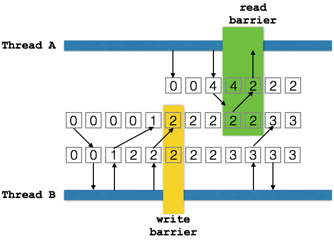

In OSGi you will write code that runs in a multi-threaded environment. There are
no safe guards, no hand-rails, and no warning signs. When you register a service
anybody can call you at any moment in time. In multi-core CPUs (are there any others?)
your code can execute multiple times in any given instant. There will be dragons
here.

Except for a few sissy Java EE App servers, this is the standard way of working for Java.
Get over it, accept it! You must consider the concurrency issues of your code. For this,
there are some excellent books out there that explain the issues. The most famous
one being Brian Goetz' book [Java Concurrency in Practice][1], the bullet train book.

This App note attempts to handle some of the important issues when you write OSGi
applications, especially with DS. However, being an app note it of course remains
on the surface of this complex topic.

The App note has a complementary workspace with all the different components
that are used to discuss the issue. You can find this workspace on [Github](https://github.com/osgi/osgi.enroute.examples.concurrency).
If you want to understand the many patterns better then load this workspace
in Bndtools and run the tests. (As a note, all components use service=... only
to make them easier to test.)

This App Note was sponsored by [SMA](http://www.sma.de/).

## Time is More Relative than You Think

Today's multi-core CPUs are amazing pieces of technology that use every trick in the
book to get the awesome performance we see today. To achieve this power CPU designers
could not maintain some invariants that software developers were accustomed to.

For a software developer it is horror to think that writing a variable does not mean
that all executing code can see the new content. Unfortunately, this is
life on modern multi-core CPUs. The [following code](https://github.com/osgi/osgi.enroute.examples.concurrency/tree/master/osgi.enroute.examples.concurrency.sync/src/osgi/enroute/examples/concurrency/sync) looks like it should stop but
it might not on a multi-core machine.

```java
	@Component(service=StopLoopWithNormalVariable.class)
	public class StopLoopWithNormalVariable extends Thread {

		boolean stop;

		@Activate
		void activate() {
			start();
		}

		public void run() {
			while (!stop)
				;
		}

		@Deactivate
		void deactivate() {
			stop = true;
		}
	}
```

The reason is that the background loop could run on its own core. This core has
its own cached copy of main memory because main memory is too slow to access on every usage.
So when the `deactivate` method writes a `true` in the `stop` variable, the background
thread remains oblivious of this since it uses its cached copy.

Sometimes the code actually works as one would expect. Strangely enough, if you
run this code in the debugger with a breakpoint in the loop then it will work as expected.
This is not a [Heisenbug] but is caused because the debugger inadvertently causes the
caches to be synchronized with main memory. As the debugger demonstrates, this is
a non-deterministic effect and any good developer should hate this kind of indeterministic
behavior.

That is why Java has a _memory model_. This does not make it easy but at least it makes
it predictable.

The following picture shows some key aspects of this memory model:



The model allows each core to execute independently from each other core using its own
cached main memory. Though the cache can hide updates from other cores haphazardly, two constructs
force the situation to become deterministic.

The first construct is the `volatile` keyword. When a volatile variable is written the VM _must_ ensure that, directly after the instruction, the cache is finished writing all prior updates to main
memory. When a volatile variable is read the value must be the same as in main memory.
These are called the _write barrier_ and the _read barrier_.

What happens between read and write barriers is left to the implementation. Compilers
and cores are free to reorder reads and writes for any reason they see fit. (Usually
to make your code run faster.) However, if you can _prove_ a variable is written
before a volatile write then that variable _must_ be visible for anybody that has done
a volatile read. For example,

```java
	int a, b, c;
	volatile int v;

	void foo() {
		a = 1;
		b = a + 1;
		c = b * a;
		v = c * c;
	}
```

Another thread may see the assignment of `c` before the assignment of `a` (or not at all) but
after it reads `v`, the other variables must have their proper values assigned.

To write proper code it is therefore paramount to understand the _happens before_ relation.
Fortunately, the OSGi specifications make it very clear what the order of
certain operations is. Once the order is defined, you have a proper happens before
relation and you're guaranteed to see anything that was written before you were
called.

As a note, a happens before relation is always between two threads although it is
transitive between threads. In the following picture the colors of the thread
bars show that though thread B makes lots of modifications, these modifications
are only defined to be visible by thread A after thread B had a write barrier
and thread A a read barrier. That is, there's been established a firm happens before
relation.


A bit of warning here. The tricky part is that most code that calls out to
other libraries tends to go through lots of read/write barriers and works
as intended. However, there is no guarantee until you can prove that there is
a proper happens before relation. That is, your code works fine in the debugger
but fails in runtime. That is, the fact that something works for you is not an
indication that you've done your work properly.

## Atomicity

Volatile variables are not atomic. For example, the following code can fail:

```java
	volatile int v;

	void foo() { v++; } // BAD!!!!
```

In this example it is possible to miss an increment because thread A can read the
variable in a register, increment it, and then store it. However, when we're unlucky
another thread reads the same value, increments it and stores it as well. This
will lose one of the updates. The more cores you have, the higher the chance this
will happen but it can actually also happen on a single core machine.

How do we protect against this?

First, there are special types in `java.util.concurrent` that provide high level
constructs that prevent many of the problems that plague the initial `synchronized`.
For this example, the Atomic Integer would be the most practical solution.

```java
	final AtomicInteger	v= new AtomicInteger(0);

	void foo() { v.incrementAndGet(); }
```

However, it helps understanding the problems these high level constructs solve by
taking a look at the `synchronized` keyword. Some problems are easier to solve with the
`synchronized` keyword.

For this problem, Java knows the construct of a _synchronized_ block. A synchronized block takes a
_lock_ object. When the synchronized block is entered it attempts to get a lock
on that object for the current thread. Only one thread can get this lock at any moment
in time.

Once the thread has the lock, it will perform a read barrier, ensuring that the cache and the
main memory are synchronized. This brings us in the wonderful position that
we are the only thread that owns the locked object and has a correct view of main memory.
This of course does not mean other threads see the same main memory. Other threads
should defer working with these variables except when inside a synchronized block that
protects them.

We can now read, make a decision on the value, and
write without having to worry that other threads interfere if they lock on the same
object while writing those variables.

At the end of the synchronized block the VM will create a write barrier, waiting
until all writes so far are flushed to main memory. Only then will it release the lock.

Therefore the following code would properly count the number of calls to `foo`.

```java
	int v;
	final Object vLock = new Object(); // protectes v

	void foo() {
		synchronized(vLock) {
			v++;
		}
	}
```

Since the synchronized block does a read barrier just after it gets the lock
and a write barrier just before it returns the lock we're guaranteed the following:

* Only one thread updates `v`
* Any thread in the block can see the changes of another thread that was in that synchronized block before

### Deadlocks

Synchronized blocks are slow due to the lock and crossing two barriers. They also have
limitations.

A synchronized block must be short and should not call out to _foreign_ code. Foreign code is code that is not under
the same control as the author of the synchronized block. The danger is that
a synchronized block can cause a _deadlock_ that way. Thread A is in a synchronized
block and causes Thread B to wait for that synchronized block. Since A now waits for B
and B waits for A they are in a deadly embrace. The chance for deadlocks is increased
massively with nested synchronizations.

If you cannot avoid blocking then make sure that you always acquire locks in
a consistent order. If one order is always followed for multiple locks then
a deadlock cannot occur.

### Special Lock Object

For this reasons synchronized blocks should only be used for the update of _owned_
data structures and not call out to foreign code. They should also not use any
object that is available outside their private scope. That is, never use a
service object to synchronize on since anybody can do that. Either use a private
object that plays a role in the scenario or create a specific object for it
with `new Object`. If you have a number of variables that are protected by the
same lock then it might be a good idea to put all of them in a private class:

```java
	static private class Atomic {
		int a;
		int b;
	}
	final Atomic together = new Atomic();

	void foo() {
		synchronized(together) {
			together.a++;
			together.b--;
		}
	}
```

Last but not least, never use the `wait()` and `notify()` methods associated with
synchronized blocks. Those use cases have effectively been replaced with the
many utility types in `java.util.concurrent`. For example, in the increment example, there
is a perfectly valid replacement with the `AtomicInteger`
class that has an increment method. However, in certain cases when the decision is
more complicated there is still use for the synchronized blocks.

For example, the following code serializes the execution of a Runnable without
requiring support for background threads. If no Runnable's are in progress it will
execute on the current thread otherwise it queues the Runnable to be executed after
the current queued Runnable's are finished.

Clearly, this requires atomic decisions. First we must decide if there are one or
more Runnable's in progress when we arrive. Second, we need to decide if there
are Runnable's queued once we've ran a Runnable.

[For example](https://github.com/osgi/osgi.enroute.examples.concurrency/tree/master/osgi.enroute.examples.concurrency.sync/src/osgi/enroute/examples/concurrency/serialize):

```java
	@Component(service=Serializer.class)
	public class Serializer {

		List<Runnable> serialized = null;
		Object lock = new Object();

		public void serialize(Runnable runnable) {

			synchronized(lock) {
				if ( serialized != null ) {
					serialized.add(runnable);
					return;
				}
				serialized= new ArrayList<>();
			}

			while(true) {

				try {
					runnable.run();
				} catch (Exception e) {
					e.printStackTrace();
				}

				synchronized(lock) {
					if ( serialized.isEmpty() ) {
						serialized = null;
						return;
					}
					runnable = serialized.remove(0);
				}
			}
		}
	}
```

(If the serialize method is very heavily used then this algorithm may block progress on a single thread since
it must keep serving the queue. But you saw that of course?)


## Atomic Objects

Since synchronized blocks are deadlock prone many algorithms have been developed to
solve concurrent problems with _lock free_ structures. In general these structures
replace locks with a retry model. Modern processors have _compare and set_ instructions
that can atomically set a memory location while returning the previous value. Though
this must pass the memory barriers it is more efficient in comparison with
a lock.

## Atomically Closing

There frequently is a potential race condition between the close operation
caused by an unbind method and the deactivate method in DS. In such cases it is
a good idea to create a `close` method that can be called multiple times. The
standard pattern is to use an Atomic Boolean.

```java
	final AtomicBoolean open = new AtomicBoolean(true);

	public void close() {
		if ( open.getAndSet(false) == false )
			return;

		// free to do the close operations
		// without worrying about this race condition
		// and we're not holding a lock!
	}
```

Such a method guarantees that only the 'first' close operation will execute
the close. The close code will then run safely outside any lock.

## Guarantees from DS

In many aspects DS is a dependency injection (DI) engine similar to Spring, Guice, or
CDI. However, in contrast with these DI engines DS components have a life cycle.
This adds the dimension of _time_ to the component, something that is utterly lacking in
any other DI engine. DS components are dynamic.

Though this extra dimension provides tremendous power it clearly comes with the
burden that things do not only get initialized, it is also possible that things go
away.

DS goes out of its way to hide that complexity. The way DS achieves this is through
very strong guarantees. DS absorbs a tremendous amount of complexity so that you
don't have to worry about it. However, many a developer writes their code defensively
and overly locks/synchronizes parts. So let's see what we can rely on.

### Ordering

DS provides a very strict ordering. This ordering implies that there is a very clear
happens before relationship between the different phases. There is no gain using volatile
variables or other synchronization constructs between these phases because this is
already been done by DS. That is, if you set an instance variable in the constructor
then there is a full guarantee that this variable is visible in the bind
or activate methods even if these methods, as is allowed, were called on different threads.

The following is the guaranteed ordering that a DS component can observe:

1. Constructor – DS will always create a new object, it will **never** reuse an existing object.
2. Bind – The bind methods or field injections are called in alphabetical order when using annotations.
   (Though dynamic methods or field injections can of course be called at any time.)
3. Activate – Only if all static reference methods and field injections are called is the activate method called. If this method does
   not throw an exception, it is guaranteed that the deactivate will be called. If
   an exception is thrown the following phases are not executed.
4. Active – During the active phase the following methods can be called in any order from
   any thread and in parallel:
   * Any methods of the registered services
   * A modified methods that dynamically takes the modified configuration properties
   * Any of the updated reference methods if defined
5. Deactivate – Clean up
6. Unbinds – And unbind methods are called
7. Release of object – DS will release the object so that no longer any references are held
8. Finalize – Java garbage collects the object

Lazy services are registered before their constructor is called. The initialization of the
DS component will take place when the service is used for the first time. However, this
should not be observable by the component itself.

## Static References

The default and simplest model of DS is to use `static` references. If a component only has
static references then it never sees any of the OSGi dynamics. This means that
with the given ordering there is no need to use volatile or other
synchronization constructs for static references. (Of course the service methods are
still called from different threads.) Field injection is the most
simple way but bind and the optional unbind methods do not require any synchronization constructs.

Sadly, many developers that start using dynamic references making the grave error of premature optimization. Yes,
you can wring more performance out of a computer making these components dynamic but
it is rarely worth the added complexity. Only go to dynamics with things like the
whiteboard and/or when you measure a significant cost for being static. In almost
all cases the static model where the component is destroyed and then recreated works
extremely well ... really.

Anyway, remember the rules about optimization:

* Do not optimize!
* Only for the experts, do not optimize yet!

## Optional References

Sometimes a component can deliver its functionality even when a reference is
absent. This is then an _optional_ reference. By far the simplest method to
handle this is to make the reference optional by specifying the cardinality:

```java
	@Component(service=ReluctantOptionalReference.class)
	public class ReluctantOptionalReference {

		@Reference(cardinality=ReferenceCardinality.OPTIONAL)
		Foo reluctantOptionalReference;

	}
```

However, this is a _static_ reference. This implies that the component is started
regardless of the presence of Foo. If Foo happens to be there then it is injected
otherwise the field remains `null`. This model is called _reluctant_.

Unfortunately, this means we miss the Foo service when it is registered a few
nanoseconds later. Since the static model has so many advantages there is an option
to reconstruct the component when this reference finds a candidate. This
is the _greedy_ mode:

```java
	@Component(service=GreedyOptionalReference.class)
	public class GreedyOptionalReference {

		@Reference(
			cardinality=ReferenceCardinality.OPTIONAL,
			policyOption=ReferencePolicyOption.GREEDY)
		Foo greedyOptionalReference;
	}
```

DS will now reconstruct the component when there is a _better_ candidate for
`foo`. Clearly any candidate will beat no candidate but what means better in the
case that we already have `foo`?

When multiple candidates are available DS will sort them by ranking. Services
with a higher _ranking_ are deemed _better_. Service ranking is indicated by a
property called `service.ranking`. It is an integer, higher is better.

One of the advantages of the static model is that in your activate method all
the way to your deactivate method your visible world won't change.

The previous examples were still static because none of the references changed
between the `activate` and `deactivate` phase. The greedy policy option achieved
its replacement by reconstructing the component. This is acceptable in most
cases but sometimes the component does not want to die for the sake of an
optional reference. In that case we can handle the situation _dynamically_.

By far the easiest solution is to mark the field as _volatile_. **A volatile
field will automatically get marked as `policy=DYNAMIC`**.

```java
	@Component(service=DynamicOptionalReference.class)
	public class DynamicOptionalReference {

		@Reference(cardinality=ReferenceCardinality.OPTIONAL)
		volatile Foo dynamicOptionalReference;
	}
```

This is simple but there is an obvious price. The following bad code shows
a common (but horrible) pattern that people use to use `foo`:

```java
	if ( foo != null ) // BAD!
		foo.bar();
```

This innocuous looking code is actually a Null Pointer Exception in the waiting.
A better way is to do:

```java
	Foo foo = this.foo;
	if ( foo != null )
		foo.bar();
```

By using a local variable we guarantee that the check (is `foo null`?) is using the
same object as the one we will call `bar()` on. This is a very cheap form of
synchronization.


## But What If The Service Disappears?

A common question that now appears is: 'What if the service goes away?'. You
could be in the process of calling a service when it becomes unregistered. Sometimes
this will cause the service to throw exceptions sometimes you get a Service Exception.

In general it is one of those cases where 'shit happens'. In a concurrent environment
like Java it is possible to end up in a sad place. Your code should always be prepared
to accept exceptions when you call other services. This does not mean you should catch
them, on the contrary. It is much better to forward the exceptions to the caller
so that they do not unnecessarily get wrapped up in wrapping exceptions and lose the
original context.

In almost all cases there is a top level function that initiated your request. It
is this function that has the responsibility to make sure the overall system
keeps working regardless of failures. This kind of robustness code is extremely
difficult to get right and should **never** be mixed with application code.

However, any locks you hold in a method should be released and resources should be closed. Any code
you call can cause exceptions. Relying on other code and not handling their exceptions
(even if they are not declared) is living a very optimistic, naive, and likely short
professional life.

## Tracking Multiple Services

If you use a whiteboard pattern or other listener like model then in general
you want to use dynamics. The reason is that you have _multiple_ references
and building and destroying the component at every change in the set of services
we're interested in (the _tracked_ services) becomes expensive.

By far the easiest method is to use field injection of a list of services.
If you make this field `volatile` then DS will inject a new list whenever the
set of tracked services changes.

```java
	@Component(service=SimpleList.class)
	public class SimpleList {

		@Reference
		volatile List<Foo>		dynamicFoos;
	}
```

However, there are many scenarios where the component must interact with the bind
and unbind of the references. The most common way is then to create a bind
and unbind method.

```java
	@Component(service = DynamicBindUnbind.class)
	public class DynamicBindUnbind {

		final List<Foo> foos = new CopyOnWriteArrayList<>();

		@Reference(
			cardinality = ReferenceCardinality.MULTIPLE,
			policy = ReferencePolicy.DYNAMIC)
		void addFoo(Foo foo) {
			foos.add(foo);
		}

		void removeFoo(Foo foo) {
			foos.remove(foo);
		}
	}
```

In this example we use a `CopyOnWriteArrayList`. This is a so called _non-locking_
object. Though it is perfectly safe to use in a concurrent environment it will not
use locks and any iteration over that list is guaranteed not to fail. Many list
types in Java will fail with a Concurrent Modification Exception if you add/remove
a value while another thread iterates. A `CopyOnWriteArrayList` won't. It has a simple
trick for this. Instead of adding a new element to the list, it replaces the
internal storage array with a new array. Iterations iterate over this array. Though
this means the iteration can visit stale objects, the length of the array and its
content will never change. Each iteration will be bound to a single generation.

### Indexing

Clearly, the previous example is identical to the `volatile List` example where DS
did the trick of `CopyOnWriteArrayList` replacing the list whenever there was a
change. Usually the bind/unbind methods are used when it is necessary to
do something with the referenced service. A common case is indexing the service
in a map with a service property. This looks as follows:

```java
	@Component(service=PlainIndexedServices.class)
	public class PlainIndexedServices {

		final ConcurrentMap<String, Foo> plainServices = new ConcurrentHashMap<>();

		@Reference(
			cardinality=ReferenceCardinality.MULTIPLE,
			policy=ReferencePolicy.DYNAMIC)
		void addFoo(Foo foo, Map<String, Object> props) {
			String key = (String) props.get("id");
			if (key == null)
				return;

			plainServices.put(key, foo);
		}

		void removeFoo(Map<String, Object> props) {
			String key = (String) props.get("id");
			if (key == null)
				return;
			plainServices.remove(key);
		}
	}
```

This example shows a number of non-obvious issues. First the `ConcurrentHashMap` is
a thread safe non-locking map. We can safely use it and we're guaranteed that it won't
lock. (It achieves this by retrying its operations so this does not mean it
returns immediately.)

Second, it does not handle the situation when the "id" property is not used in
a unique way. If multiple different services use the same id then this code could
get confused.

### Wrapping

In numerous cases when we use indexed services we need to track a number of
variables based on each service. That is, when a new service enters the system
we need to do some work that creates data we do not want to loose until we
no longer track the service.

In an object oriented environment the easiest way is to create a wrapper around
the service. This wrapper can hold the per-service data and we can use its methods
to handle the behavior. A simplistic example:

```java
	class Wrap {
		final Foo foo;
		boolean closed;

		public Wrap(Foo foo) {
			this.foo = foo;
		}

		public void close() {
			closed = true;
		}
	}
```

This raises a life cycle issue. In the previous example we ignored any
services that went away or had the same id. This is acceptable because we had no cleaning
up to do after the service disappeared. With a wrapper there is no such
luxury since we need to close the wrapper. We therefore need to detect duplicates
and we need to detect and handle them in a thread-safe way.

The Concurrent Map API specifies that both `put` and `remove` return the object
that was at that moment associated with the given key. The concept of _previous_ is
an atomic concept. That is, if a key is removed twice on different threads only one
will return a previous value and the other will receive `null`.

In both the `add` and `remove` bind methods we therefore need to close the
previous wrapper, if any.

```java
	@Component(service=WrappedIndexedServices.class)
	public class WrappedIndexedServices {

		final ConcurrentMap<String, Wrap> wrappedServices = new ConcurrentHashMap<>();

		@Reference(
			cardinality=ReferenceCardinality.MULTIPLE,
			policy=ReferencePolicy.DYNAMIC)
		void addFoo(Foo foo, Map<String, Object> props) {
			String key = (String) props.get("id");
			if (key == null)
				return;

			Wrap previous = wrappedServices.put(key, new Wrap(foo));
			if ( previous != null) {
				previous.close();
			}
		}

		void removeFoo(Map<String, Object> props) {
			String key = (String) props.get("id");
			if (key == null)
				return;

			Wrap previous = wrappedServices.remove(key);
			if ( previous != null) {
				previous.close();
			}
		}
	}
```

### Multiple Services per Key

In the previous example there was the implicit assumption that there was a
unique key per service. However, in some use cases a key can map to multiple
services. This complicates our problem a bit. Let's first design a holder for
our services

```java
	class Holder {
		final Set<Foo> foos =  ConcurrentHashMap.newKeySet();

		boolean add( Foo foo) {
			return foos.add(foo);
		}

		boolean remove( Foo foo) {
			return foos.remove(foo);
		}
	}
```

Since Java does not have a ConcurrentSet we create one by using the key set
from the Concurrent Hash Map. A bit hackish but the only way in Java.

Since the bind/unbind methods are called concurrent we must ensure that we atomically
process the addition of the first and the removal of the last. In this code we
use the `compute` methods on Concurrent Map.

```java
	@Component(service=HolderIndexedMultipleServices.class)
	public class HolderIndexedMultipleServices {

		final ConcurrentMap<String, Holder> multis = new ConcurrentHashMap<>();

		@Reference(
			cardinality=ReferenceCardinality.MULTIPLE,
			policy=ReferencePolicy.DYNAMIC)
		void addFoo(Foo foo, Map<String, Object> props) {
			String key = (String) props.get("id");
			if (key == null)
				return;

			multis.compute(key, (k,v) -> {
				if ( v == null)
					v = new Holder();
				v.add(foo);
				return v;
			});
		}

		void removeFoo(Foo foo, Map<String, Object> props) {
			String key = (String) props.get("id");
			if (key == null)
				return;

			multis.computeIfPresent(key, (k,v) -> {
				v.remove(foo);
				return v.foos.isEmpty() ? null : v;
			});
		}
	}
```

The `compute` methods map an old value to the next value. However, no lock is held,
which implies that the mapping method can be called multiple times. This requires
therefore that our mapping function is _idempotent_.

That is, we must be able to call it multiple times without creating side effects. For this reason we use a
`Set` instead of a `List` to ensure there are no duplicates. Adding to a list could cause multiple same Foo
services to be the list.

In the `removeFoo` method we use the `computeIfPresent` method which only calls our
mapping function if the key already exists. Again, also this function can be called multiple
times and must also be idempotent.

<!--
1. Should there be a note about equality here since these map/set examples rely on it?

2. Should there be a note about service ordering in these, or is that out of scope or left as an excersize for the reader to explore.
-->

You can find the code for these examples [here](https://github.com/osgi/osgi.enroute.examples.concurrency/tree/master/osgi.enroute.examples.concurrency.sync/src/osgi/enroute/examples/concurrency/dynamic);

## Cycles

A very nasty problem exists when there are cycles in your service references. If component Bottom
has a static reference to component Top and Top has references to all Bottom's then you have
a cycle. This is not an uncommon case but will not work in a simple way with DS
even though the specification explicitly allows it for dynamic references. The problem is
that many services are lazy.

DS implementations run into problems when the Top component is being injected
with the dynamic Bottom services. If Bottom is defined as _lazy_ then the construction
of Bottom fails.

A lazy service is registered as a service but not yet created. It is created on demand. However, the demand comes from
the exact object that needs to be injected so it is not yet ready for injection. You will therefore get an
error like 'Circular reference detected, getService returning null'.

The best solution to this problem is to make the Bottom service `immediate`. Since
the Bottom service has a mandatory reference on the Top service it will not register
a service before the Top component is registered as a service. Once the Top service is registered,
the Bottom service(s) are satisfied and can then register. This registration will then
cause their injection in the Top component since Top has dynamic references to
Bottom.

```java
	@Component(service=Top.class,immediate=false)
	public class Top {

		@Reference
		volatile List<Bottom>		circularReferenceToBottoms;

	}

	@Component(service=Bottom.class, immediate=true)
	public class Bottom {

		@Reference
		Top			circularReferenceToTop;

	}
```

See for the code [here](https://github.com/osgi/osgi.enroute.examples.concurrency/tree/master/osgi.enroute.examples.concurrency.sync/src/osgi/enroute/examples/concurrency/cycle).

## Background Threads

One of the easiest ways to prevent concurrency problems is to execute all code
on a single thread. This is called _thread confinement_. Any work that gets queued on this thread will then not
require any synchronization. This pattern is used in many cases to actually increase
performance because the only synchronization required is the queuing of the
the work operations. All work can then be executed without locks and barriers inside
the thread.

However, these loops must be extremely well protected against exceptions. Once
the background thread loop exits it is game over. The following code shows
a background thread that executes the work in a single thread.

```java
	@Component
	public class Background extends Thread implements Work {

		final BlockingQueue<Runnable>	queue	= new LinkedBlockingQueue<>();
		int								counter;

		public Background() {
			super("Background");
		}

		@Activate
		void activate() {
			start();
		}

		@Deactivate
		void deactivate() {
			interrupt();
		}

		@Override
		public void work() {
			queue.add(() -> {
				counter++;
			});
		}

		public void run() {
			while (!isInterrupted())
				try {
					Runnable take = queue.take();
					try {
						take.run();
					} catch (Exception e) {
						e.printStackTrace();
					}
				} catch (InterruptedException e) {
					interrupt();
					return;
				} catch (Throwable e) {
					e.printStackTrace();
				} finally{
					System.out.println("Exiting background");
				}
		}
	}
```

You can find the code [here](https://github.com/osgi/osgi.enroute.examples.concurrency/tree/master/osgi.enroute.examples.concurrency.sync/src/osgi/enroute/examples/concurrency/queue).

## IO Server

A related problem is when IO needs be processed synchronously, for example a
TCP/IP socket server. The inner loop is even more complicated than the inner
loop of the simple queuing example because there are more failure scenarios.

* The interrupt we used in that previous example does not work for the synchronous
  Java IO calls. To stop these loops, it will be necessary to close the
  server socket.
* We need to ensure that errors are not overloading the system. It will be necessary
  to delay for some time between errors.
* All connections that are opened must be closed when the component is deactivated.

This is surprisingly complex as the following code testifies:

```java
	@Component(immediate=true)
	public class BackgroundIO extends Thread {

		ServerSocket	serverSocket;

		@Reference
		Executor		executor;

		public BackgroundIO() {
			super("BackgroundIO");
		}

		@Activate
		void startBackgroundThread() {
			start();
		}

		@Deactivate
		void stopBackgroundThread() throws IOException {
			interrupt();
			bestEffortClose(serverSocket);
		}

		public void run() {

			List<Socket> openConnections = new CopyOnWriteArrayList<>();

			try {
				while (!isInterrupted())
					try {
						serverSocket = new ServerSocket(0);
						while (!isInterrupted()) {
							Socket connection = serverSocket.accept();
							try {
								openConnections.add(connection);
								processConnection(connection,openConnections);
							} catch (Exception e) {
								e.printStackTrace();
							}
						}
					} catch (Exception t) {

						// No report of exceptions
						// when we're interrupted

						if (isInterrupted())
							return;

						t.printStackTrace();

						try {
							// Prevent overload (e.g. bind exception
							Thread.sleep(1000);
						} catch (InterruptedException e) {
							interrupt();
							return;
						}
					}
			} catch (Throwable t) {
				t.printStackTrace();
				throw t;
			} finally {
				bestEffortClose(serverSocket);
				openConnections.forEach( this::bestEffortClose );
			}
		}

		private void bestEffortClose(AutoCloseable s) {
			try {
				if ( s == null)
					return;
				s.close();
			} catch( Exception e) {
				//ignore
			}
		}

		private void processConnection(Socket connection, List<Socket> openConnections) {
			executor.execute(() -> {
				try {
					while(connection.isConnected()) {
						// do work
					}
				} finally {
					openConnections.remove(connection);
					bestEffortClose(connection);
				}
			});
		}
	}
```

## Event Loops

In many scenarios it is necessary to send events to other services; this often
happens in whiteboard scenarios. Just like the background loops, event loops
must be written very defensively to not kill the main task of the service. This often
is an argument to use the OSGi Event Admin to handle the events since the Event
Admin will handle many scenarios where an Event Handler acts badly.

However, in certain cases it is necessary to handle these events in your code.
The following is a template for a well protected event loop with blacklisting.

```java
	@Component(service = EventLoop.class)
	public class EventLoop {

		@Reference
		volatile List<EventHandler>		handlers;

		final Map<EventHandler, Long>	blacklist	= Collections
				.synchronizedMap(new WeakHashMap<>());

		@Reference
		Executor						executor;

		public void dispatch(int n) {
			handlers.stream()
				.filter(this::timeout)
				.forEach((handler) -> dispatchInBackground(n, handler));
		}

		private void dispatchInBackground(int n, EventHandler handler) {
			executor.execute(() -> {
				try {
					handler.send(n);
				} catch (Exception e) {
					blacklist.put(handler, System.currentTimeMillis() + 5000);
					e.printStackTrace();
				}
			});
		}

		boolean timeout(EventHandler handler) {
			long currentTimeMillis = System.currentTimeMillis();
			Long timeout = blacklist.get(handler);

			if (timeout != null) {

				if (timeout > currentTimeMillis)
					return false;

				blacklist.remove(handler);
			}
			return true;
		}
	}
```

You can find this code [here](https://github.com/osgi/osgi.enroute.examples.concurrency/tree/master/osgi.enroute.examples.concurrency.sync/src/osgi/enroute/examples/concurrency/events).

## Asynchronous APIs

Though threads are in general not as expensive as developers think, they do consume
resources. In many systems significant performance gains can be achieved when
processing is done asynchronously instead of calling a blocking API.

In these scenarios the OSGi Promise is a friend because it provides a simple but
very powerful model to chain asynchronous calls while not forgetting exception
management. The basic model of a Promise is:

```java
	Promise<Bar> getBar() {
		Promise<Foo>	p = startFoo();
		return p
			.then( this::step1 )
			.then( this::step2 )
			.then( this::step3 )
			.then( this::step4 )
			.then( this::step5, this::failure );
	}
```

In the real world this code will execute completely independent of its invocation.
Each step will be executed when the previous step is _resolved_. The best part of
it all is that when any of the steps fail, the final promise failure method
is invoked. This makes it relatively easy to sequence a number of steps
without blocking a thread.

A Promise is created with a Deferred. The template for using a Promise looks like:

```java
	@Component(service = Factorial.class)
	public class Factorial {

		@Reference
		Executor executor;

		public Promise<BigInteger> fac(long n) {
			Deferred<BigInteger> deferred = new Deferred<>();
			executor.execute(() -> {
				try {
					BigInteger result = BigInteger.ONE;
					for ( int i= 2; i<n; i++) {
						result = result.multiply( BigInteger.valueOf(i));
					}
					deferred.resolve(result);
				} catch (Throwable e) {
					e.printStackTrace();
					deferred.fail(e);
				}
			});
			return deferred.getPromise();
		}

	}
```

You can find this code [here](https://github.com/osgi/osgi.enroute.examples.concurrency/tree/master/osgi.enroute.examples.concurrency.sync/src/osgi/enroute/examples/concurrency/promise).

## Activation and Initialization with Promises

The activate method (a method marked with the @Activate annotation) is called
before the service is registered. This method should not stay away too long.
What to do when there is some lengthy initialization? A common pattern
is to start the initialization on a background thread but then block in all
methods that require the initialization to have finished. These are the
service methods and also the deactivate method.

An ideal object for this is the OSGi _Promise_. It can defer an operation
to the future. In the following example we show how to use a promise to:

* start the initialization in a background thread
* block until the initialization is finished when called on a working method of the service
* defer the deactivate method until initialization is done. This can potentially mean that
  the actual close method is called on another thread, much later than the deactivate method.

The following code implements this.

```java
	@Component
	public class Initialize implements Work {
		Promise<Delegate>	promise;
		volatile boolean	closed;

		@Reference
		Executor			executor;

		@Activate
		void activate() throws Exception {
			Deferred<Delegate> deferred = new Deferred<>();
			executor.execute(() -> {
				try {
					Thread.sleep(2000); // long running init
					deferred.resolve(new Delegate());
				} catch (Exception e) {
					deferred.fail(e);
				}
			});
			promise = deferred.getPromise();
		}

		@Override
		public void work() throws Exception {
			promise.getValue().work();
		}

		@Deactivate
		void deactivate() {
			promise.onResolve(this::close);
		}

		void close() {
			closed = true;
		}
	}
```

You can find this code [here](https://github.com/osgi/osgi.enroute.examples.concurrency/tree/master/osgi.enroute.examples.concurrency.sync/src/osgi/enroute/examples/concurrency/init).

## Modifying Configuration Properties

If the configuration of a component changes then DS can dynamically update the
component if it defines a _modified_ method. This method must be marked with the
@Modified annotation. The following is an example.

```java
	@Component(service=DynamicModifiedConfiguration.class, configurationPolicy=ConfigurationPolicy.REQUIRE)
	public class DynamicModifiedConfiguration {

		int		config;

		@interface Config {
			int config() default 1;
		}

		@Activate
		void activate(Config config) {
			this.config = config.config();
		}

		@Modified
		void modified(Config config) {
			this.config = config.config();
		}
	}
```

You can find this code [here](https://github.com/osgi/osgi.enroute.examples.concurrency/tree/master/osgi.enroute.examples.concurrency.sync/src/osgi/enroute/examples/concurrency/modified).

## Updating the Service Properties of a Reference

If the service properties of a service change while a component has a reference then the
component must be reactivated unless it has defined an _updated_ method. The updated
method is added by giving it the name of the reference prefixed with `updated`. The
following code shows this:

```java
	@Component(service=DynamicUpdatedReferenceProperties.class)
	public class DynamicUpdatedReferenceProperties {

		int foo;

		@Reference
		void setFoo( Foo foo, Map<String,Object> map) {
			this.foo = (int) map.getOrDefault("property", -1);
		}

		void updatedFoo( Map<String,Object> map) {
			this.foo = (int) map.getOrDefault("property", -2);
		}
	}
```

You can find this code [here](https://github.com/osgi/osgi.enroute.examples.concurrency/tree/master/osgi.enroute.examples.concurrency.sync/src/osgi/enroute/examples/concurrency/modified_ref).

## Conclusion

Concurrency and its associated areas are hard. Software is hard. We hope that this
app note helped you see a number of error scenarios and provide you with some
patterns to solve these problems.

If you know more patterns and/or error scenarios then do not hesitate to provide
a Pull Request on this repository. This is one way of saying thank you.


[1]: https://www.amazon.com/Java-Concurrency-Practice-Brian-Goetz/dp/0321349601
[Heisenbug]: https://en.wikipedia.org/wiki/Heisenbug