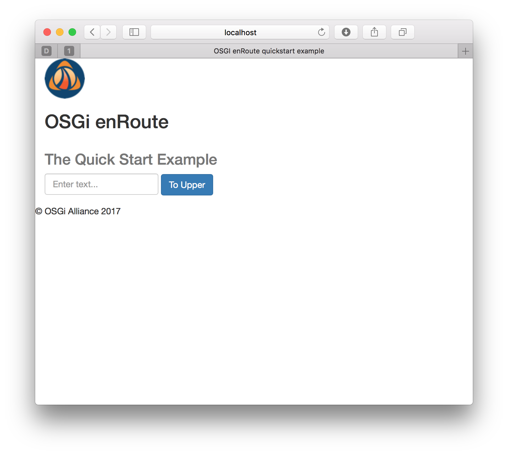
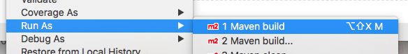
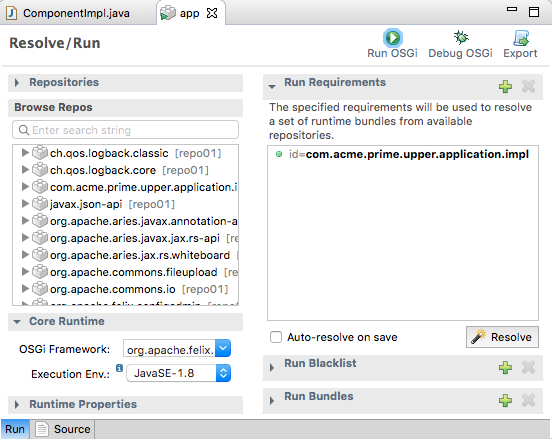
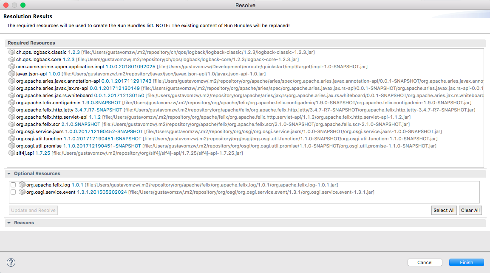
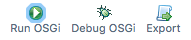
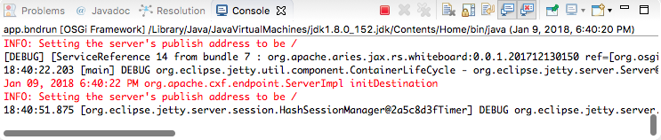
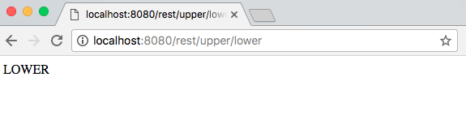
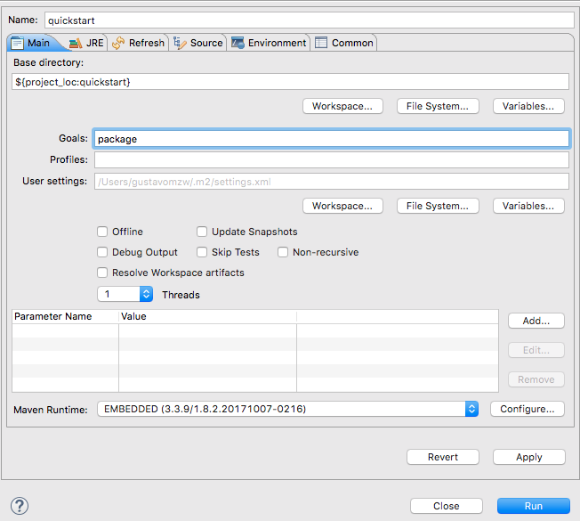
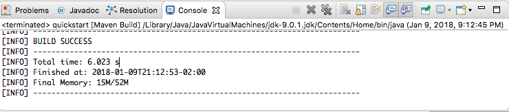

## Summary 

In this tutorial we'll first run, and then re-create and re-run, a simple OSGi™ Microservice.

## Build & Run

We start by first downloading, building and running the enRoute `quickstart` example. In addition to demonstrating the simple application this will also confirm that your local [environment](015-Prerequisite.html#required-tools) meets the require prerequisites.

Download the [enroute examples](https://github.com/osgi/osgi.enroute) from GitHub and change directory into `examples/quickstart`.

### Building the example
 
Build the Application with the following commands:

    $ mvn bnd-resolver:resolve
    $ mvn package
{: .shell } 

### Running the example

We now have a runnable artifact which can be started with the command 

    $ java -jar app/target/app.jar
{: .shell }

To test that the application is running visit the [quickstart](http://localhost:8080/quickstart/index.html) application URL for a friendly greeting,

{: height="400px" width="400px"}

or if minimalisim is more your thing, the raw REST endpoint [http://localhost:8080/rest/upper/lower](http://localhost:8080/rest/upper/lower).

When you want to terminate the application press **Ctrl+C**.

## Recreating Quickstart

We'll now recreate the quickstart example locally as though it were your own greenfield OSGi project. 

It is assumed that you have the required [environment](015-Prerequisite.html#required-tools) installed on your laptop and created the [settings.xml](017-enRoute-ArcheTypes.html#project-setup-for-snapshot-archetypes) project skeleton in your project root directory. 
{: .note }

### Project Setup

First issue the command to create the project template

    $ mvn -s settings.xml archetype:generate -DarchetypeGroupId=org.osgi.enroute.archetype -DarchetypeArtifactId=project -DarchetypeVersion=7.0.0-SNAPSHOT
{: .shell }

Fillng the the project details with appropriate values 

    Define value for property 'groupId': org.osgi.enroute.examples.quickstart
    Define value for property 'artifactId': quickstart
    Define value for property 'version' 1.0-SNAPSHOT: :
    Define value for property 'package' org.osgi.enroute.examples: : org.osgi.enroute.examples.quickstart.rest
    Confirm properties configuration:
    groupId: com.acme.example
    artifactId: quickstart
    version: 1.0-SNAPSHOT
    package: com.acme.example
    Y: : 
{: .shell }

If you're using an IDE then this would be a good time to import the generated maven projects
{: .note }

### Implementing the MicroService

Having created the project skeleton, edit `quickstart/impl/src/main/java/org/osgi/enroute/examples/quickstart/rest/ComponentImpl.java` 


package org.osgi.enroute.examples.quickstart.rest;

import org.osgi.service.component.annotations.Component;

@Component
public class ComponentImpl {
    
    //TODO add an implementation
    
}



and add the following implementation details

  <a class="btn btn-primary" data-toggle="collapse" href="#Upper" aria-expanded="false" aria-controls="Upper">
    Upper.java
  </a>

  





  

and then save the file.

The important modifications include:
* A JAX-RS resource method implementation, replacing the the `TODO` section
* The `@Component` is modified to register this component as an OSGi service
* The `@JaxrsResource` annotation is used to mark this as a JAX-RS whiteboard resource.
* Remember to change the name of the component from `ComponentImpl.java` to `Upper.java`

### Building the implementation

It's now time to build the implementation project.

 <ul class="nav nav-tabs" role="tablist">
  <li role="presentation" class="active"><a href="#impl-build-cli" aria-controls="impl-build-cli" role="tab" data-toggle="tab">Using the CLI</a></li>
  <li role="presentation"><a href="#impl-build-eclipse" aria-controls="impl-build-eclipse" role="tab" data-toggle="tab">Using Eclipse</a></li>
 </ul>

 

  

From the `quickstart/impl` project we now build the impl bundle.

    $ mvn install
{: .shell }
      
Here, we use the `install` goal to make sure that the built artifact is available to other projects in later steps

If the `install` fails, continue to the next stage - resolve - then repeate `mvn install` 
{: .warning }
  

  

When using Bndtools your IDE will be incrementally rebuilding your projects every time that you save, so there's no need to run a build. You can also run a build manually.
      
Right click the `quickstart` module in the left pane, and select **Run As -> Maven**

Enter package as the goal and click **Run**
  

 

### Resolving the Application

Before generating the runtime dependency information used by the OSGi framework take a look at the file `quickstart\app\app.bndrun`


index: target/index.xml

-standalone: ${index}

-runrequires: osgi.identity;filter:='(osgi.identity=org.osgi.enroute.examples.quickstart.impl)'
-runfw: org.apache.felix.framework
-runee: JavaSE-1.8


As shown, the bndrun contains a `runrequires` statement that specifies a [capability](../FAQ/200-resolving.html#namespaces); i.e. the implementation for `quickstart`. However, no `runbundles` a currently listed; i.e. the actual bundles needed at runtime to create `quickstart`.

The `runbundles` are automatically calculated for us via the process of [resolving](../FAQ/200-resolving.html).

 <ul class="nav nav-tabs" role="tablist">
  <li role="presentation" class="active"><a href="#resolve-cli" aria-controls="resolve-cli" role="tab" data-toggle="tab">Using the CLI</a></li>
  <li role="presentation"><a href="#resolve-eclipse" aria-controls="resolve-eclipse" role="tab" data-toggle="tab">Using Eclipse</a></li>
 </ul>

 

  

From the `quickstart/app` project we now resolve the application using the bnd-resolver-maven-plugin

    $ mvn bnd-resolver:resolve
{: .shell }

  

  

In the `app` maven module, open the `app.bndrun` to display the `Bndtools Resolve` screen. Here we can see that the implementation bundle is added to the run requirements.

Click the **Resolve** button...

{: height="400px" width="400px"}

Now click **Finish** button...

{: height="400px" width="400px"}
  

 

If you look again at the `app.bndrun` file you will now see that our rest service implementation `org.osgi.enroute.examples.quickstart.impl`, OSGi Declarative Services implementation `org.apache.felix.scr`, and a number of other bundles required at runtime are now listed by `runbundles`.


index: target/index.xml

-standalone: ${index}

-runrequires: osgi.identity;filter:='(osgi.identity=org.osgi.enroute.examples.quickstart.impl)'
-runfw: org.apache.felix.framework
-runee: JavaSE-1.8
-runbundles: \
        ch.qos.logback.classic;version='[1.2.3,1.2.4)',\
        ch.qos.logback.core;version='[1.2.3,1.2.4)',\
        javax.json-api;version='[1.0.0,1.0.1)',\
        org.apache.aries.javax.annotation-api;version='[0.0.1,0.0.2)',\
        org.apache.aries.javax.jax.rs-api;version='[0.0.1,0.0.2)',\
        org.apache.aries.jax.rs.whiteboard;version='[0.0.1,0.0.2)',\
        org.apache.felix.configadmin;version='[1.9.0,1.9.1)',\
        org.apache.felix.http.jetty;version='[3.4.7,3.4.8)',\
        org.apache.felix.http.servlet-api;version='[1.1.2,1.1.3)',\
        org.apache.felix.scr;version='[2.1.0,2.1.1)',\
        org.osgi.enroute.examples.quickstart.impl;version='[1.0.0,1.0.1)',\
        org.osgi.service.jaxrs;version='[1.0.0,1.0.1)',\
        org.osgi.util.function;version='[1.1.0,1.1.1)',\
        org.osgi.util.promise;version='[1.1.0,1.1.1)',\
        slf4j.api;version='[1.7.25,1.7.26)'


### Running the application

We now create a runnable application JAR.

Note that in this version of `quickstart` only the REST endpoint will be available.
{: .note} 

 <ul class="nav nav-tabs" role="tablist">
  <li role="presentation" class="active"><a href="#run-cli" aria-controls="run-cli" role="tab" data-toggle="tab">Using the CLI</a></li>
  <li role="presentation"><a href="#run-eclipse" aria-controls="run-eclipse" role="tab" data-toggle="tab">Using Eclipse</a></li>
 </ul>

 

  

Now that the initial development is done we're ready to build and package the whole application by running the following command in the project root
      
    $ mvn package
{: .shell }

Your version of `quickstart` may now be started as described [above](020-tutorial_qs.html#running-the-example); the REST endpoint at [http://localhost:8080/rest/upper/lower](http://localhost:8080/rest/upper/lower).
  

  

In the `app` maven module, open the `app.bndrun` to display the `Bndtools Resolve` screen. Select the **Run OSGi** button

See the results in the console screen.

With the project running, navigate to [http://localhost:8080/rest/upper/lower](http://localhost:8080/rest/upper/lower) and check the results

If you want to get hold of the runnable application jar then right click the `quickstart` module in the left pane, and select **Run As -> Maven**

Enter package as the goal and click **Run**

{: height="400px" width="400px"}

Wait for maven to finish the generation.

The runnable jar file created will be `app/target/app.jar`, and may be started as described [above](020-tutorial_qs.html#running-the-example); the REST endpoint at [http://localhost:8080/rest/upper/lower](http://localhost:8080/rest/upper/lower).

   

 

