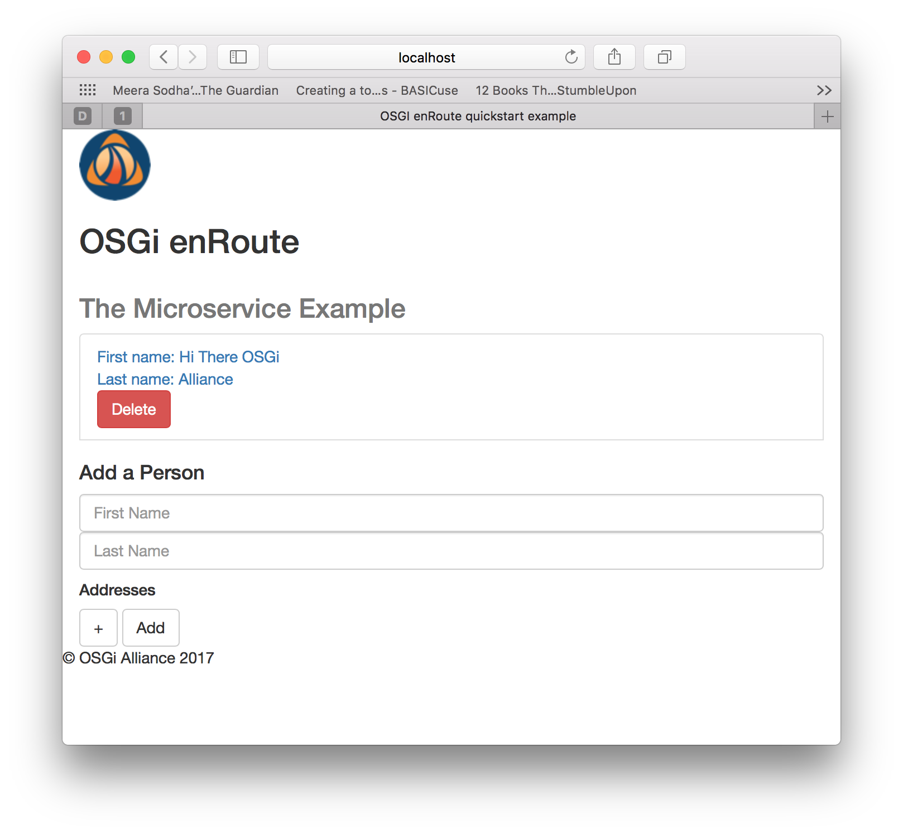

This tutorial is Maven and command-line based; the reader may follow this verbatim or use their favorite Java/IDE.

## Introduction

Using the [enRoute ArcheTypes](017-enRoute-ArcheTypes.html) this tutorial walks through the creation of REST microservice comprised of the following structural elements:
* An API module
* A DAO Implementation module
* A Rest Service Implementation module 
* The Composite Application module

with each module having a POM that describes its dependencies.

We start by creating the required project skeleton.

## Creating the Project

Using the [bare-project Archetype](017-enRoute-ArcheTypes.html#the-project-archetype), in your project root directory (i.e. the directory containing your [`settings.xml` configuration](017-enRoute-ArcheTypes.html#project-setup-for-snapshot-archetypes)), create the **microservice** project:

    $ mvn -s settings.xml archetype:generate -DarchetypeGroupId=org.osgi.enroute.archetype -DarchetypeArtifactId=project-bare -DarchetypeVersion=7.0.0-SNAPSHOT
{: .shell }

with the following values:

    Define value for property 'groupId': org.osgi.enroute.examples
    Define value for property 'artifactId': microservice
    Define value for property 'version' 1.0-SNAPSHOT: : 0.0.1-SNAPSHOT
    Define value for property 'package' org.osgi.enroute.examples: :
    Confirm properties configuration:
    groupId: org.osgi.enroute.examples
    artifactId: microservice
    version: 0.0.1-SNAPSHOT
    package: org.osgi.enroute.examples
    Y: :
{: .shell }

**Note** - if you use alternative `groupId`, `artifactId` values remember to update the `packageinfo` and `import` statements in the files used throughout the rest of this tutorial.
{: .note }

We now create the required modules. 

## The DAO API 

Change directory into the newly created `microservice` project directory; then create the `api` module using the [api Archetype](017-enRoute-ArcheTypes.html#the-api-archetype) as shown:

    $ mvn -s ../settings.xml archetype:generate -DarchetypeGroupId=org.osgi.enroute.archetype -DarchetypeArtifactId=api -DarchetypeVersion=7.0.0-SNAPSHOT
{: .shell }

with the following values:

    Define value for property 'groupId': org.osgi.enroute.examples.microservice
    Define value for property 'artifactId': dao-api
    Define value for property 'version' 1.0-SNAPSHOT: : 0.0.1-SNAPSHOT
    Define value for property 'package' org.osgi.enroute.examples.microservice: :org.osgi.enroute.examples.microservice.dao
    Confirm properties configuration:
    groupId: org.osgi.enroute.examples.microservice
    artifactId: dao-api
    version: 0.0.1-SNAPSHOT
    package: org.osgi.enroute.examples.microservice.dao 
    Y: :
{: .shell }

Now create the following two files:

`dao-api/src/main/java/org/osgi/enroute/examples/microservice/dao/PersonDao.java`

  <a class="btn btn-primary" data-toggle="collapse" href="#PersonDao" aria-expanded="false" aria-controls="PersonDao">
    PersonDAO.java 
  </a>

  





`dao-api/src/main/java/org/osgi/enroute/examples/microservice/dao/AddressDao.java`

  <a class="btn btn-primary" data-toggle="collapse" href="#AddressDao" aria-expanded="false" aria-controls="AddressDao">
    AddressDAO.java 
  </a>

  





### Dependencies

`dao-api` has no dependencies.

### Visibility
`dao-api` is an API package which is imported by `RestComponentImpl`, `PersonDaoImpl` & `AddressDaoImpl`; hence it must must be exported. This is indicated by the automatically generated file `dao-api/src/main/java/org/osgi/enroute/examples/microservice/dao/package-info.java`: 

  <a class="btn btn-primary" data-toggle="collapse" href="#package-info-dao" aria-expanded="false" aria-controls="package-info-dao">
    package-info.java
  </a>

  





  

For further detail see [Semantic Versioning](../FAQ/210-semantic_versioning.html).

### Defining the DTO 

Data transfer between the components is achieved via the use of [Data Transfer Objects (DTO's)](../FAQ/420--dtos.html).

To achieve this create the following two files:

`dao-api/src/main/java/org/osgi/enroute/examples/microservice/dao/dto/PersonDTO.java`

  <a class="btn btn-primary" data-toggle="collapse" href="#PersonDTO" aria-expanded="false" aria-controls="PersonDTO">
    PersonDTO.java 
  </a>

  





`dao-api/src/main/java/org/osgi/enroute/examples/microservice/dao/dto/AddressDTO.java`

  <a class="btn btn-primary" data-toggle="collapse" href="#AddressDTO" aria-expanded="false" aria-controls="AddressDTO">
   AddressDTO.java 
  </a>

  



 

and again, we advertise this Capability by creating the following `package-info.java` file: 

`dao-api/src/main/java/org/osgi/enroute/examples/microservice/dao/dto/package-info.java`

  <a class="btn btn-primary" data-toggle="collapse" href="#package-info-dto" aria-expanded="false" aria-controls="package-info-dto">
    package-info.java
  </a>

  





## The DAO implementation 

In the `microservice` project director now create the `impl` module using the [ds-component Archetype](017-enRoute-ArcheTypes.html#the-ds-component-archetype):

    $ mvn -s ../settings.xml archetype:generate -DarchetypeGroupId=org.osgi.enroute.archetype -DarchetypeArtifactId=ds-component -DarchetypeVersion=7.0.0-SNAPSHOT
{: .shell }

with the following values:

    Define value for property 'groupId': org.osgi.enroute.examples.microservice
    Define value for property 'artifactId': dao-impl
    Define value for property 'version' 1.0-SNAPSHOT: : 0.0.1-SNAPSHOT
    Define value for property 'package' org.osgi.enroute.examples.microservice: : org.osgi.enroute.examples.microservice.dao.impl
    Confirm properties configuration:
    groupId: org.osgi.enroute.examples.microservice
    artifactId: dao-impl
    version: 0.0.1-SNAPSHOT
    package: org.osgi.enroute.examples.microservice.dao.impl
    Y: :
{: .shell }

Now create the following four files:

`dao-impl/src/main/java/org/osgi/enroute/examples/microservice/dao/impl/PersonTable.java`

  <a class="btn btn-primary" data-toggle="collapse" href="#PersonTable" aria-expanded="false" aria-controls="PersonTable">
    PersonTable.java 
  </a>

  





`dao-impl/src/main/java/org/osgi/enroute/examples/microservice/dao/impl/PersonDaoImpl.java`

  <a class="btn btn-primary" data-toggle="collapse" href="#PersonDaoImpl" aria-expanded="false" aria-controls="PersonDaoImpl">
    PersonDaoImpl.java 
  </a>

  





`dao-impl/src/main/java/org/osgi/enroute/examples/microservice/dao/impl/AddressTable.java`

  <a class="btn btn-primary" data-toggle="collapse" href="#AddressTable" aria-expanded="false" aria-controls="AddressTable">
    AddressTable.java 
  </a>

  





`dao-impl/src/main/java/org/osgi/enroute/examples/microservice/dao/impl/AddressDaoImpl.java`

  <a class="btn btn-primary" data-toggle="collapse" href="#AddressDaoImpl" aria-expanded="false" aria-controls="AddressDaoImpl">
    AddressDaoImpl.java 
  </a>

  





### Dependencies

The `dao-impl` has a dependency on `dao-api`. Also `PersonalDaoImpl.java` and `AddressDaoImpl.java` implementations (see below) have dependencies on the `slf4j` logging API. This dependency information is added to the `<dependencies>` section of `dao-impl/pom.xml`: i.e. `dao-impl`'s [repository](../FAQ/200-resolving.html#managing-repositories).


<dependency>
    <groupId>org.osgi.enroute.examples.microservice</groupId>
    <artifactId>dao-api</artifactId>
    <version>0.0.1-SNAPSHOT</version>
</dependency>
<dependency>
    <groupId>org.slf4j</groupId>
    <artifactId>slf4j-api</artifactId>
    <version>1.7.25</version>
</dependency>


### Visibility

Implmentations should **NOT** be shared; hence no `package-info.java` file.
{: .note } 

## The REST Service

In the `microservice` project director now create the `rest-component` module using the [rest-component Archetype](017-enRoute-ArcheTypes.html#the-rest-component-archetype):

    $ mvn -s ../settings.xml archetype:generate -DarchetypeGroupId=org.osgi.enroute.archetype -DarchetypeArtifactId=rest-component -DarchetypeVersion=7.0.0-SNAPSHOT
{: .shell }

with the following values:

    Define value for property 'groupId': org.osgi.enroute.examples.microservice
    Define value for property 'artifactId': rest-service
    Define value for property 'version' 1.0-SNAPSHOT: : 0.0.1-SNAPSHOT
    Define value for property 'package' org.osgi.enroute.examples.microservice: : org.osgi.enroute.examples.microservice.rest
    Confirm properties configuration:
    groupId: org.osgi.enroute.examples.microservice
    artifactId: rest-service
    version: 0.0.1-SNAPSHOT
    package: org.osgi.enroute.examples.microservice.rest
    Y: :
{: .shell }

Now create the following two files: 

`rest-service/src/main/java/org/osgi/enroute/examples/microservice/rest/RestComponentImpl.java`

  <a class="btn btn-primary" data-toggle="collapse" href="#RestComponentImpl" aria-expanded="false" aria-controls="RestComponentImpl">
    RestComponentImpl.java 
  </a>

  





`rest-service/src/main/java/org/osgi/enroute/examples/microservice/rest/JsonpConvertingPlugin.java`

  <a class="btn btn-primary" data-toggle="collapse" href="#JsonpConvertingPlugin" aria-expanded="false" aria-controls="JsonpConvertingPlugin">
   JsonpConvertingPlugin.java 
  </a>

  





Create the directory `rest-service/src/main/resources/static/main/html` and added the following file:

`rest-service/src/main/resources/static/main/html/person.html`

  <a class="btn btn-primary" data-toggle="collapse" href="#person" aria-expanded="false" aria-controls="person">
    person.html
  </a>

  



  

And also the `rest-service/src/main/resources/static/css` directory for the following `style.css` file

`rest-service/src/main/resources/static/css/style.css`

  <a class="btn btn-primary" data-toggle="collapse" href="#style" aria-expanded="false" aria-controls="style">
   style.css 
  </a>

  





Finally, place the following `index.html` file in directory `rest-service/src/main/resources/static`

`rest-service/src/main/resources/static/index.html`

  <a class="btn btn-primary" data-toggle="collapse" href="#index" aria-expanded="false" aria-controls="index">
    index.html 
  </a>

  





and create the directory `rest-service/src/main/resources/static/main/img` into which save the following icon with the name `enroute-logo-64.png`

 

### Dependencies

As the `rest-service` module has dependencies on the `dao-api` and `json-api` these dependencies are added to the `<dependencies>` section in `rest-service/pom.xml`. A `JSON-P` implementation dependency is also included so that the `rest-service` can be unit tested. 


<dependency>
    <groupId>org.apache.servicemix.specs</groupId>
    <artifactId>org.apache.servicemix.specs.json-api-1.1</artifactId>
    <version>2.9.0</version>
</dependency>
<dependency>
    <groupId>org.osgi.enroute.examples.microservice</groupId>
    <artifactId>dao-api</artifactId>
    <version>0.0.1-SNAPSHOT</version>
</dependency>
<dependency>
    <groupId>org.apache.johnzon</groupId>
    <artifactId>johnzon-core</artifactId>
    <version>1.1.0</version>
</dependency>


### Visibility

Implmentations should **NOT** be shared; hence no `package-info.java` file.
{: .note }

## The Composite Application 

We now pull these Modules together to create the Composite Application.
 
In the `microservice` project directory create the `application` module using the [application Archetype](017-enRoute-ArcheTypes.html#the-application-archetype):

    $ mvn -s ../settings.xml archetype:generate -DarchetypeGroupId=org.osgi.enroute.archetype -DarchetypeArtifactId=application -DarchetypeVersion=7.0.0-SNAPSHOT
{: .shell }

with the following values:

    Define value for property 'groupId': org.osgi.enroute.examples.microservice
    Define value for property 'artifactId': rest-app
    Define value for property 'version' 1.0-SNAPSHOT: : 0.0.1-SNAPSHOT
    Define value for property 'package' org.osgi.enroute.examples.microservice: :
    Define value for property 'impl-artifactId': rest-service 
    Define value for property 'impl-groupId' org.osgi.enroute.examples.microservice: :
    Define value for property 'impl-version' 0.0.1-SNAPSHOT: :
    Confirm properties configuration:
    groupId: org.osgi.enroute.examples.microservice
    artifactId: rest-app
    version: 0.0.1-SNAPSHOT
    package: org.osgi.enroute.examples.microservice
    impl-artifactId: dao-impl
    impl-groupId: org.osgi.enroute.examples.microservice
    impl-version: 0.0.1-SNAPSHOT
    Y: :
{: .shell }

### Define Runtime Entity

Our Microservice is composed of the following elements:
* A rest-service
* An implementation of JSON-P (org.apache.johnzon.core)
* An in memory database (H2).

These dependencies are expressed as runtime Requirements in the `rest-app/rest-app.bndrun` file:


index: target/index.xml

-standalone: ${index}

-resolve.effective: active

-runrequires: \
    osgi.identity;filter:='(osgi.identity=org.osgi.enroute.examples.microservice.rest-service)',\
    osgi.identity;filter:='(osgi.identity=org.apache.johnzon.core)',\
    osgi.identity;filter:='(osgi.identity=org.h2)',\
    bnd.identity;version='0.0.1.201801031655';id='org.osgi.enroute.examples.microservice.rest-app'
-runfw: org.apache.felix.framework
-runee: JavaSE-1.8


### Dependencies

By adding the following dependencies inside the `<dependencies>` section of the file `rest-app/pom.xml`, we added the necessary Capabilities to the `rest-app`'s respository.


<dependency>
    <groupId>org.osgi.enroute.examples.microservice</groupId>
    <artifactId>dao-impl</artifactId>
    <version>0.0.1-SNAPSHOT</version>
</dependency>
<dependency>
    <groupId>org.apache.johnzon</groupId>
    <artifactId>johnzon-core</artifactId>
    <version>1.1.0</version>
</dependency>
<dependency>
    <groupId>com.h2database</groupId>
    <artifactId>h2</artifactId>
    <version>1.4.196</version>
    <scope>runtime</scope>
</dependency>


### Runtime Configuration

Finally, our Microservice will be configured using the new R7 Configurator mechanism.

The [application Archetype](017-enRoute-ArcheTypes.html#the-application-archetype) enables this via `rest-app/src/main/java/config/package-info.java`. 

  <a class="btn btn-primary" data-toggle="collapse" href="#package-info-config" aria-expanded="false" aria-controls="package-info-config">
    package-info.java
  </a>

  





All that is required is to pass in the appropriate configuration by overwrite the contents of `rest-app/src/main/resources/OSGI-INF/configurator/configuration.json` with the following:

 

  <a class="btn btn-primary" data-toggle="collapse" href="#configuration" aria-expanded="false" aria-controls="configuration">
    configuration.json
  </a>

  





## Build

Build the modules and install in local maven repository from the top level project directory

    mvn install
{: .shell }

**Note** - if `rest-app` fails, run the following resolve command and then re-run `mvn install` 
{: .note }

We now generate the required OSGi indexes from the project dependencies.

    mvn bnd-resolver:resolve
{: .shell }

And finally generate the runnable jar from the top level project directory

    mvn package
{: .shell }

Re-inspecting `rest-app/rest-app.bndrun` we can see that this now explicitly references the acceptable version range for each required OSGi bundle. At runtime the OSGi framework resolves these _requirements_ against the _capabilities_ in the specified target repository: i.e. `target/index.xml`.  


index: target/index.xml

-standalone: ${index}

-resolve.effective: active

-runrequires: \
    osgi.identity;filter:='(osgi.identity=org.osgi.enroute.examples.microservice.rest-service)',\
    osgi.identity;filter:='(osgi.identity=org.apache.johnzon.core)',\
    osgi.identity;filter:='(osgi.identity=org.h2)',\
    bnd.identity;version='0.0.1.201801031655';id='org.osgi.enroute.examples.microservice.rest-app'
-runfw: org.apache.felix.framework
-runee: JavaSE-1.8
-runbundles: \
        ch.qos.logback.classic;version='[1.2.3,1.2.4)',\
        ch.qos.logback.core;version='[1.2.3,1.2.4)',\
        org.apache.aries.javax.annotation-api;version='[0.0.1,0.0.2)',\
        org.apache.aries.javax.jax.rs-api;version='[0.0.1,0.0.2)',\
        org.apache.aries.jax.rs.whiteboard;version='[0.0.1,0.0.2)',\
        org.apache.felix.configadmin;version='[1.9.0,1.9.1)',\
        org.apache.felix.configurator;version='[0.0.1,0.0.2)',\
        org.apache.felix.http.jetty;version='[3.4.7,3.4.8)',\
        org.apache.felix.http.servlet-api;version='[1.1.2,1.1.3)',\
        org.apache.felix.scr;version='[2.1.0,2.1.1)',\
        org.apache.johnzon.core;version='[1.1.0,1.1.1)',\
        org.apache.servicemix.specs.json-api-1.1;version='[2.9.0,2.9.1)',\
        org.h2;version='[1.4.196,1.4.197)',\
        org.osgi.enroute.examples.microservice.dao-api;version='[0.0.1,0.0.2)',\
        org.osgi.enroute.examples.microservice.dao-impl;version='[0.0.1,0.0.2)',\
        org.osgi.enroute.examples.microservice.rest-app;version='[0.0.1,0.0.2)',\
        org.osgi.enroute.examples.microservice.rest-service;version='[0.0.1,0.0.2)',\
        org.osgi.service.jaxrs;version='[1.0.0,1.0.1)',\
        org.osgi.util.converter;version='[1.0.0,1.0.1)',\
        org.osgi.util.function;version='[1.1.0,1.1.1)',\
        org.osgi.util.promise;version='[1.1.0,1.1.1)',\
        slf4j.api;version='[1.7.25,1.7.26)',\
        tx-control-provider-jdbc-xa;version='[1.0.0,1.0.1)',\
        tx-control-service-xa;version='[1.0.0,1.0.1)'


## Run 

To dynamically assembled and run the resultant REST Microservice; simply change back to the top level project directory and type the command: 

    java -jar rest-app/target/rest-app.jar
{: .shell }

The REST service can be seen by pointing a browser to [http://localhost:8080/microservice/index.html](http://localhost:8080/microservice/index.html)

{: height="450px" width="450px"}

Stop the application using Ctrl+C in the console.

Finally, if we create and run the [debug version](022-tutorial_osgi_runtime.html) of the Microservice we can see all of the OSGi bundles used in the actual runtime assembly.

    g! lb
    START LEVEL 1
       ID|State      |Level|Name
        0|Active     |    0|System Bundle (5.7.0.SNAPSHOT)|5.7.0.SNAPSHOT
        1|Active     |    1|Logback Classic Module (1.2.3)|1.2.3
        2|Active     |    1|Logback Core Module (1.2.3)|1.2.3
        3|Active     |    1|Apache Aries Javax Annotation API (0.0.1.201711291743)|0.0.1.201711291743
        4|Active     |    1|Apache Aries JAX-RS Specification API (0.0.1.201803231639)|0.0.1.201803231639
        5|Active     |    1|Apache Aries JAX-RS Whiteboard (0.0.1.201803231640)|0.0.1.201803231640
        6|Active     |    1|Apache Commons FileUpload (1.3.2)|1.3.2
        7|Active     |    1|Apache Commons IO (2.5.0)|2.5.0
        8|Active     |    1|Apache Felix Configuration Admin Service (1.9.0.SNAPSHOT)|1.9.0.SNAPSHOT
        9|Active     |    1|Apache Felix Configurer Service (0.0.1.SNAPSHOT)|0.0.1.SNAPSHOT
       10|Active     |    1|Apache Felix Gogo Command (1.0.2)|1.0.2
       11|Active     |    1|Apache Felix Gogo Runtime (1.0.10)|1.0.10
       12|Active     |    1|Apache Felix Gogo Shell (1.0.0)|1.0.0
       13|Active     |    1|Apache Felix Http Jetty (3.4.7.R7-SNAPSHOT)|3.4.7.R7-SNAPSHOT
       14|Active     |    1|Apache Felix Servlet API (1.1.2)|1.1.2
       15|Active     |    1|Apache Felix Inventory (1.0.4)|1.0.4
       16|Active     |    1|Apache Felix Declarative Services (2.1.0.SNAPSHOT)|2.1.0.SNAPSHOT
       17|Active     |    1|Apache Felix Web Management Console (4.3.4)|4.3.4
       18|Active     |    1|Apache Felix Web Console Service Component Runtime/Declarative Services Plugin (2.0.8)|2.0.8
       19|Active     |    1|Johnzon :: Core (1.1.0)|1.1.0
       20|Active     |    1|Apache ServiceMix :: Specs :: JSon API 1.1 (2.9.0)|2.9.0
       21|Active     |    1|H2 Database Engine (1.4.196)|1.4.196
       22|Active     |    1|dao-api (0.0.1.201803251221)|0.0.1.201803251221
       23|Active     |    1|dao-impl (0.0.1.201803251221)|0.0.1.201803251221
       24|Active     |    1|rest-app (0.0.1.201803251650)|0.0.1.201803251650
       25|Active     |    1|rest-service (0.0.1.201803251221)|0.0.1.201803251221
       26|Active     |    1|org.osgi:org.osgi.service.jaxrs (1.0.0.201803131808-SNAPSHOT)|1.0.0.201803131808-SNAPSHOT
       27|Active     |    1|org.osgi:org.osgi.util.converter (1.0.0.201803131810-SNAPSHOT)|1.0.0.201803131810-SNAPSHOT
       28|Active     |    1|org.osgi:org.osgi.util.function (1.1.0.201803131808-SNAPSHOT)|1.1.0.201803131808-SNAPSHOT
       29|Active     |    1|org.osgi:org.osgi.util.promise (1.1.0.201803131808-SNAPSHOT)|1.1.0.201803131808-SNAPSHOT
       30|Active     |    1|osgi.cmpn (4.3.1.201210102024)|4.3.1.201210102024
       31|Active     |    1|slf4j-api (1.7.25)|1.7.25
       32|Active     |    1|OSGi Transaction Control JDBC Resource Provider - XA Transactions (1.0.0.201801251821)|1.0.0.201801251821
       33|Active     |    1|Apache Aries OSGi Transaction Control Service - XA Transactions (1.0.0.201801251821)|1.0.0.201801251821
{: .shell }

