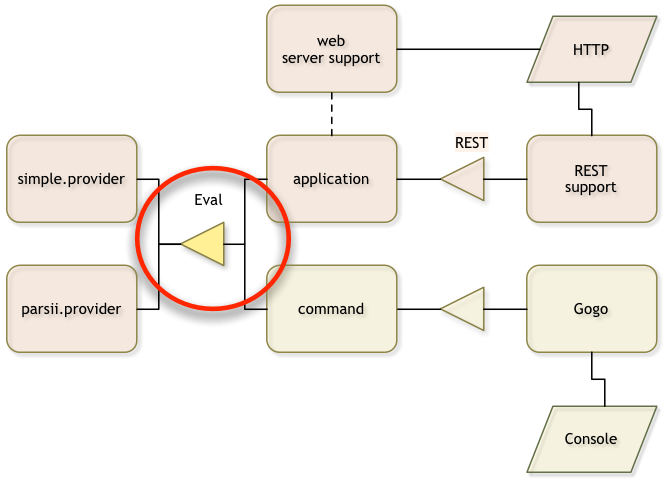

## What you will learn in this section
In this section we are going to create an API for a simple expression evaluator. 
It will teach you how to create an API project, how to name a project, and how to 
navigate around in the project. We also explain how to version packages.

Make sure you are in the top directory:

	$ cd ~/workspaces/osgi.enroute.examples.eval
{: .shell }

## Creating a POM 

You should create a directory `api` in the `osgi.enroute.examples.eval` directory. In this
directory we create a `pom.xml`. 

	osgi.enroute.examples.eval $ mkdir api
	osgi.enroute.examples.eval $ cd api
	api $ vi pom.xml
	// fill in the content from the next sections
{: .shell }	

This POM should look like:

	<project 
		xmlns="http://maven.apache.org/POM/4.0.0" 
		xmlns:xsi="http://www.w3.org/2001/XMLSchema-instance"
		xsi:schemaLocation="http://maven.apache.org/POM/4.0.0 http://maven.apache.org/xsd/maven-4.0.0.xsd"
	>
		<modelVersion>4.0.0</modelVersion>
		
Define the parent pom, we inherit lots of information from
that POM.

		<parent>
			<groupId>org.osgi</groupId>
			<artifactId>osgi.enroute.examples.eval</artifactId>
			<version>1.0.0-SNAPSHOT</version>
		</parent>
		
We inherit the version and group Id from our parent POM so we only have to specify
the artifact Id. The artifact Id will also act as the Bundle Symbolic Name. In OSGi enRoute
the following (highly recommended) conventions are advised for the last segment of the
artifact Id name:

* `.api` – API only project
* `.provider`, `adapter` – An implementation project
* `.application` – An application project. This is a project that binds together a set of components and parameterizes them.
* `.test` – An OSGi test project, tests are run inside a framework. 

The name of the bundle

		<artifactId>osgi.enroute.examples.eval.api</artifactId>

This bundle generates a JAR that contains the API code with the OSGi metadata. We therefore need
to package it as a JAR.

		<packaging>jar</packaging>

Documentation is always desired:
		
		<description>Eval API</description>
		
	</project>

Verify your pom by running `mvn verify`.

	api $ mvn verify
	...
	[INFO] ------------------------------------------------------------------------
	[INFO] BUILD SUCCESS
	[INFO] ------------------------------------------------------------------------
	...
{: .shell }
	
## The Source

We want to make a component that evaluates expressions. We first define the contract. 
The service contract for now could be an interface. Define the following in the
`src/main/java/osgi/enroute/examples/eval/Eval.java` file in the `osgi.enroute.examples.eval/api` directory.

	api $ mkdir -p src/main/java/osgi/enroute/examples/eval/api
	api $ vi src/main/java/osgi/enroute/examples/eval/api/Eval.java
	// fill in the content from the next section
{: .shell }
	
	package osgi.enroute.examples.eval.api;
	/**
	 * A service that evaluates an expression and returns the result
	 */

	public interface Eval {
		/**
		 * Evaluate an expression and return the result.
		 */
		double eval(String expression) throws Exception;
	}
	

## Versioning

In OSGi packages that are shared between bundles have a _version_. Though this
sounds horrendously complex for a developer that are used to the Maven version
chores, rest assured. The bnd maven plugin significantly simplifies version handling.

We therefore need to put a file in the package directory that contains the version.
We use an annotation on the package for this. Therefore, create a file `package-info.java`
with the following content in the package directory:

	api $ vi src/main/java/osgi/enroute/examples/eval/api/package-info.java
	// fill in the content from the next section
{: .shell }

	@org.osgi.annotation.versioning.Version("1.0.0")
	package osgi.enroute.examples.eval.api;

The bnd plugin will pickup this version and add it to the manifest when the
package is exported. You should change the version when you make changes to the
package content. 

## Semantic Versioning

The OSGi strongly recommends _semantic versioning_. The rules for semantic versioning
prescribe what part of the version to change based on compatibility. Semantic version
is very important for package version and you should strictly follow them. (There is
a plugin that can verify when you violate the rules based on Java's binary compatibility
model.)

A version consists of 4 parts in OSGi:

* Major – The first number. If it is changed between releases it indicates that it is incompatible with the previous release.
* Minor – The second number. If it is changed between releases it indicates that _providers_ are broken but _consumers_ are compatible.
* Micro – The third number. If it is changed between releases  it means that there is no binary nor semantic change, for example an improved comment.
* Qualifier – The last segment. This is normally changed between builds.

### Provider & Consumer Types

In this API, any party that will implement the `Eval` interface is considered to be 
the _provider_. A provider must fully implement a contract that has virtually no 
backward compatibility unlike _consumers_ of this API. Any change in the version 
that affects the public API must result in  rebuild of the provider's bundle. That 
is, if our version here goes to 1.1 we want to make sure our providers that implemented 
1.0 are no longer compatible.  

Obviously it is a nightmare to ensure that the proper version ranges are used. We can 
significantly help the provider by adding an annotation to this interface:

	import org.osgi.annotation.versioning.ProviderType;
	
	@ProviderType
	public interface Eval { ... }
	
The bnd tool will now automatically ensure that any _implementers_ of this interface 
use semantic versioning to import the package with a minor range, for example `[1.0,1.1)`
because they are deemed a provider.

Interfaces that are implemented by the consumer of your API (usually listener like interfaces) 
can be annotated with the `@ConsumerType` annotation. However, this is the default.
 
If you find this hard to grasp then you're not alone. This is a very complex area. We 
will get back to this later so don't worry if you do not immediately grasp it.

## The bnd File

The bnd plugin provides the OSGi metadata and keeps us honest. The plugin, defined in the parent POM, 
requires a bnd.bnd file in the same directory as the POM. In our case, we provide 
the API we should therefore export the package.

	api $ vi bnd.bnd
	// fill in content from next section
{: .shell }

	#
	# OSGi enRoute Examples Eval API Project
	#

	Bundle-Description: 				\
		An API for an expression parser
	
	Require-Capability: \
		compile-only
	
	Export-Package: osgi.enroute.examples.eval.api

A `bnd.bnd` file is a properties file, same rules apply. Comments can be added 
by starting a line with a hash mark (`#`). The first word on the line is the key and
then a space, a ':' or '=' marks the separator. The rest is the value minus any leading
spaces.

Keys that start with an upper case character are added to the manifest, other
keys are macros and can be used anywhere with the `${key}` syntax.

The Bundle-Description key should be self describing.

### Compile Only

If you look in the `bnd.bnd` file you see that this API bundle is compile only:

	Require-Capability: \
		compile-only

The reason this is compile only is that best practices dictate that the provider 
should export its API. There have been numerous discussions about this and some opinions 
differ. However, a provider of an API is extremely closely tied to the version of the 
API it provides. Virtually any change in the API requires a change in the provider, 
there is no backward compatibility as there is for the API consumers. Therefore, by 
exporting the API from the provider you make the whole system less complex.

### Export 

All packages in the project are automatically added to the bundle. By default, these packages are private.
The Export-Package header tells bnd to add the export header for the `osgi.enroute.examples.eval.api` package.
 
 
## Building

Our `osgi.enroute.examples.eval/api` directory should look as follows:

	bnd.bnd
	pom.xml
	src/main/java/osgi/enroute/examples/eval/api/package-info.java
	src/main/java/osgi/enroute/examples/eval/api/Eval.java

You might have a `target` directory, this is where maven stores temporary files. To update/create the
target we run `mvn install` again.

	api $ mvn install
	...
	api $ ls -1 target
	classes
	generated-sources
	maven-archiver
	maven-status
	osgi.enroute.examples.eval.api-1.0.0-SNAPSHOT.jar
{: .shell }

There are some additional files in the target directory. Since we did an install, we also copied the JAR to
the Maven local repository in `~/.m2/repository/org/osgi/osgi.enroute.examples.eval.api/1.0.0-SNAPSHOT/osgi.enroute.examples.eval.api-1.0.0-SNAPSHOT.jar`.

	api $ ls ~/.m2/repository/org/osgi/osgi.enroute.examples.eval.api/1.0.0-SNAPSHOT/osgi.enroute.examples.eval.api-1.0.0-SNAPSHOT.jar
	~/.m2/repository/org/osgi/osgi.enroute.examples.eval.api/1.0.0-SNAPSHOT/osgi.enroute.examples.eval.api-1.0.0-SNAPSHOT.jar
{: .shell }

If we have bnd installed as command line tool then you can take a look at the manifest:

	$ bnd print target/osgi.enroute.examples.eval.api-1.0.0-SNAPSHOT.jar 
	[MANIFEST osgi.enroute.examples.eval.api-1.0.0-SNAPSHOT]
	Bnd-LastModified                         1474982517123                           
	Build-Jdk                                1.8.0_25                                
	Built-By                                 aqute                                   
	Bundle-Description                       An API for an expression parser         
	Bundle-ManifestVersion                   2                                       
	Bundle-Name                              osgi.enroute.examples.eval.api           
	Bundle-SymbolicName                      osgi.enroute.examples.eval.api           
	Bundle-Version                           1.0.0.201609271321                      
	Created-By                               1.8.0_25 (Oracle Corporation)           
	Export-Package                           osgi.enroute.examples.eval.api;version="1.0.0"
	Manifest-Version                         1.0                                     
	Require-Capability                       compile-only,osgi.ee;filter:="(&(osgi.ee=JavaSE)(version=1.8))"
	Tool                                     Bnd-3.3.0.201609221906                  

	[IMPEXP]
	Export-Package
	  osgi.enroute.examples.eval.api          {version=1.0.0}
{: .shell }

You can printout more by using the print options that you can see with `bnd help print`.

## How does it Work?

When we run maven the bnd plugin will analyze the class files and use the information
that is inside these files, which includes the annotations, to generate a manifest. The
bnd tool has a lot of OSGi knowledge embedded and it can find many errors and warnings
to signal ideas that are not such a good idea.

The plugin places the manifest and other files in the `target/classes` directory. This
directory is then made into a JAR by the Maven jar plugin.

In M2Eclipse, the bnd plugin runs after every change but the JAR plugin does not. So the classes
directory is updated but not the JAR. You need to run `maven install` to create the JAR in
the local repository.

## What Have We Done?

You've just created your first bundle with maven! We've created a service API bundle that
we can use in other projects to compile against but it cannot be used in
runtime.

We spent some effort on learning the semantic versioning rules and how to provide
package versions in OSGi.

