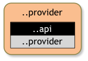

## What You will Learn in this Section

In this section we create another project that provides an implementation for our 
Eval API, a so called _provider_. In this case we call this the `simple.provider`.
We will also export the api package from the
provider bundle and explain why this will be simplifying your life.

Make sure you are in the top directory:

	$ cd ~/workspaces/osgi.enroute.examples.eval
{: .shell }

## About Services

A _service_ is an object that is registered by a _bundle_. It is registered under
an interface and a set of properties. Services are dynamic which means that we
have to write code that uses services defensively. Since this  a lot of
work we use [Declarative Services] to simplify this considerably with annotations. 

## Create a Provider Project

In the previous section we created an API for an expression evaluator. We now need a 
so called *provider* for this service. A provider is responsible for the contract 
defined in the API so that *consumers* can use the service. In the case of the 
Eval service the consumer will call the `eval(String)` method and the provider must 
implement this method. 

In the `osgi.enroute.examples.eval` directory we create a directory called `simple.provider`.
In this directory we create the POM. 

	osgi.enroute.examples.eval $ mkdir simple.provider
	osgi.enroute.examples.eval $ cd simple.provider
	simple.provider $
{: .shell }
	
## POM

	simple.provider $ vi pom.xml
	// fill in from next section
{: .shell }

	<project 
		xmlns="http://maven.apache.org/POM/4.0.0" 
		xmlns:xsi="http://www.w3.org/2001/XMLSchema-instance" 
		xsi:schemaLocation="http://maven.apache.org/POM/4.0.0 http://maven.apache.org/xsd/maven-4.0.0.xsd"
	>
	  <modelVersion>4.0.0</modelVersion>

The parent and packaging is the same as for the API project:

	  <parent>
	  	<groupId>org.osgi</groupId>
	  	<artifactId>osgi.enroute.examples.eval</artifactId>
	  	<version>1.0.0-SNAPSHOT</version>
	  </parent>
	  
	  <packaging>jar</packaging>

In the previous section we also learned that the last segment in the 
project name defines its *type*; this is supported by OSGi enRoute templates. A provider 
project must therefore have a name that ends in `.provider`. We also like to start 
the project name with the workspace, the service API name and an indication of what 
kind of implementation this is. Well, this is going to be an awful simple implementation, 
so the name should be: `osgi.enroute.examples.eval.simple.provider`. So in the POM we should have:

	  <artifactId>osgi.enroute.examples.eval.simple.provider</artifactId>
	  <description>Eval Provider</description>

We inherit the OSGi enRoute base API (a collection of standardized and specialized service contracts to 
make it easy for web apps) but in this case we need the API project as dependency
	  
	  <dependencies>
	  	<dependency>
	  		<groupId>org.osgi</groupId>
	  		<artifactId>osgi.enroute.examples.eval.api</artifactId>
	  		<version>1.0.0-SNAPSHOT</version>
	  	</dependency>
	  </dependencies>
	  
	</project>

## Implementation Source

We now need to add an implementation class. In this case we use regular expressions as the parser to 
implement a very simplistic evaluation parser in the file `src/main/java/osgi/enroute/examples/eval/provider/EvalImpl.java`:

	simple.provider $ mkdir -p src/main/java/osgi/enroute/examples/eval/provider
	simple.provider $ vi src/main/java/osgi/enroute/examples/eval/provider/EvalImpl.java
{: .shell }
	
	package osgi.enroute.examples.eval.provider;
	
	import java.util.regex.Matcher;
	import java.util.regex.Pattern;
	
	import org.osgi.service.component.annotations.Component;
	import org.osgi.service.component.annotations.Reference;
	import org.osgi.service.log.LogService;
	
	import osgi.enroute.examples.eval.api.Eval;
	
	@Component(name = "osgi.enroute.examples.eval.provider")
	public class EvalImpl implements Eval {
		Pattern EXPR = Pattern.compile( "\\s*(?<left>\\d+)\\s*(?<op>\\+|-)\\s*(?<right>\\d+)\\s*");
		
		@Reference
		LogService log;
		
		
		@Override
		public double eval(String expression) throws Exception {
			Matcher m = EXPR.matcher(expression);
			if ( !m.matches()) {
				log.log(LogService.LOG_WARNING, "Invalid expression " + expression);
				throw new IllegalArgumentException("Invalid expression " + expression);
			}
			
			double left = Double.valueOf( m.group("left"));
			double right = Double.valueOf( m.group("right"));
			switch( m.group("op")) {
			case "+": return left + right;
			case "-": return left - right;
			}
			return Double.NaN;
		}
	}

Ok, ok, simple might still give it too much credit but we're not here to learn parsing. 
At least it has (some) error handling! Notice that we can only handle trivial additions and 
subtractions of constants.

This class is setup as a Declarative Service (DS) µservice component because the `@Component` 
annotation was added. If your component class implements one or more interfaces, then these 
will be automatically registered as OSGi services. So in this case, we want to implement 
an `Eval` interface so that we're registered as an Eval service. 

We can use the `Eval` interface because we added the `org.osgi:osgi.enroute.examples.eval.api:1.0.0-SNAPSHOT` project 
to our dependencies.

## The bnd File

To make a proper bundle we need to have a `bnd.bnd` file in the same directory as our POM. This file looks
like:

	simple.provider $ vi bnd.bnd
	// fill in content from next section
{: .shell }

	#
	# OSGi enRoute Eval Example
	#
	
	Bundle-Description: 				\
		Provides a simple implementation for an eval parser
	
	Export-Package: osgi.enroute.examples.eval.api

## Exporting API

Observant readers would have noticed that the the `osgi.enroute.examples.eval.api` package is
exported but it is not part of this project. This is one of the magic, and extremely useful,
tricks of bnd. Any package listed in Export-Package or Private-Package headers will be copied
from the classpath even if not part of the project.

However, this raises the question why should the API be included in the bundle? Should the
API not be a separate bundle?

The reason we export the API from the provider bundle is that it makes life a lot easier
when we assemble the executable and it has no hidden cost. The primary reason it has no
hidden cost is due to _compatibility_. A provider has virtually no backward compatibility
with its API as was explained in the semantic versioning section. Any change in the
API will require an update of the provider code to ensure the provider implements any 
additional obligations of the contract.

Therefore, separating the API from the provider has no use since a given provider
will virtually always use the same API version. Carrying this version of the API
causes fewer bundles and less error prone metadata.

There are OSGi experts who do not completely agree though.

## Build

In Maven-terms we've now defined a multi-module project, currently containing two modules : api and simple.provider.
The modules should be defined in an aggregator pom, and often this is done in the parent pom.
We should add a <modules> section in the pom.xml in the parent folder

	simple.provider $ cd ..
	osgi.enroute.examples.eval $ vi pom.xml
	// fill in from next section, right before the <properties> section
{: .shell }

	  <modules>
	  	<module>api</module>
	  	<module>simple.provider</module>
	  </modules>

We now have enough project information to build the bundle. As we've changed the parent pom, it's best to do a clean build from there.
And then we can take a look at how our module (bundle) really looks like.
Make sure you're in the top directory!

	osgi.enroute.examples.eval $ mvn clean install
	...
	osgi.enroute.examples.eval $ cd simple.provider
	simple.provider $ bnd print target/osgi.enroute.examples.eval.simple.provider-1.0.0-SNAPSHOT.jar
	[MANIFEST osgi.enroute.examples.eval.provider-1.0.0-SNAPSHOT]
	Bnd-LastModified                         1474989660493                           
	Build-Jdk                                1.8.0_25                                
	Built-By                                 aqute                                   
	Bundle-Description                       Provides a simple implementation for an eval parser
	Bundle-ManifestVersion                   2                                       
	Bundle-Name                              osgi.enroute.examples.eval.simple.provider      
	Bundle-SymbolicName                      osgi.enroute.examples.eval.simple.provider      
	Bundle-Version                           1.0.0.201609271521                      
	Created-By                               1.8.0_25 (Oracle Corporation)           
	Export-Package                           osgi.enroute.examples.eval.api;version="1.0.0"
	Import-Package                           osgi.enroute.examples.eval.api;version="[1.0,1.1)"
	Manifest-Version                         1.0                                     
	Private-Package                          osgi.enroute.examples.eval.provider      
	Provide-Capability                       osgi.service;objectClass:List<String>="osgi.enroute.examples.eval.api.Eval"
	Require-Capability                       osgi.ee;filter:="(&(osgi.ee=JavaSE)(version=1.8))"
	Require-Capability                       osgi.extender;filter:="(&(osgi.extender=osgi.component)(version>=1.3.0)(!(version>=2.0.0)))",osgi.service;filter:="(objectClass=org.osgi.service.log.LogService)";effective:=active,osgi.ee;filter:="(&(osgi.ee=JavaSE)(version=1.8))"
	Service-Component                        OSGI-INF/osgi.enroute.examples.eval.provider.xml
	Tool                                     Bnd-3.3.0.201609221906                  

	[IMPEXP]
	Import-Package
	  org.osgi.service.log                    {version=[1.3,2)}
	  osgi.enroute.examples.eval.api          {version=[1.0,1.1)}
	Export-Package
	  osgi.enroute.examples.eval.api          {version=1.0.0, imported-as=[1.0,1.1)}
{: .shell }

From this we can see the following layout of our provider bundle.

* *Private packages* – Packages that are only available inside the bundle. Another 
  bundle could have the same name for the package but different contents. 
* *Exported packages* – Packages that we provide to other bundles and which we are supposed to maintain over time.
* *Imported packages* – Packages we expect someone else to export, hoping that they are as good as we will be in maintaining that package over time.

In a diagram:

## How Does it Work?

The concepts of consumers and providers can be confusing, mostly because it is often 
confused with implementers of an interface and the clients of an interface. However, 
providers of a service API can both implement and/or be a client of interfaces in 
the service package. A provider is responsible for providing the value of the contract, 
and a consumer receives the value of the contract. The reason we need to distinguish 
between these two roles is that they have far ranging consequences for how you package 
and version bundles.

Lets say you buy a house from me. In this scenario you are consumer of the contract 
and I am the provider of the contract. These roles are, surprisingly, not symmetrical. 
For example, if the seller adds an extra room after the contract was signed then the buyer 
will not object (ok, in general, you get my point). However, if the seller removes 
a room the buyer is going to be upset. A consumer can expect backward compatibility 
but a provider is closely bound to the contract. Virtually any change in the service 
contract will require a provider to be updated to provide the new functions. 

So a consumer is relatively distant from the contract and it often plays the role 
of a consumer in many different service contracts. A provider usually provides only 
a single service contact while being a consumer in other service contracts.  

Therefore the best practice in OSGi is for a provider to include its service API 
codes and export it. Separating the API from the provider makes no sense since 
there is a 1:1 relation between provider and API, unlike the consumer that will 
get backward compatibility from the API. Having the API in the bundle just makes 
life easier. That said, do not make the mistake to place them in the same _project_ 
since that would require compiling against a JAR that would also contain the implementation. 
Compilation should always be done against API only JARs to prevent accidentally 
becoming dependent on implementation code.

[Declarative Services]: /services/org.osgi.service.component.html

## What Did We Learn?

In this section we created a simplistic provider bundle for the Eval service API.
We exported the Eval service API in this bundle but also import it.

