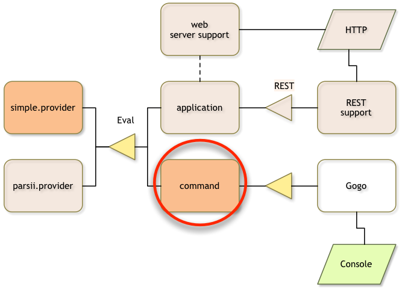

## What you will learn in this section

So far, the provider is idly sitting in the framework registering an Eval service.
In this section we develop a simple Gogo command that allows us to call this 
service and test it from the command line.  

A Gogo command is a simple service that has some magic properties. It can
implement multiple commands.

Make sure you are in the top directory:

	$ cd ~/workspaces/osgi.enroute.examples.eval
{: .shell }

## Creating a POM 

We need to create a directory called `command` in the `osgi.enroute.examples.eval` 
directory. In this directory we need to create a `pom.xml` file. The POM is quite standard now:

	osgi.enroute.examples.eval $ mkdir command
	osgi.enroute.examples.eval $ cd command
	command $ vi pom.xml
	// Add the pom.xml
{: .shell }

And the content:

	<project 
		xmlns="http://maven.apache.org/POM/4.0.0" 
		xmlns:xsi="http://www.w3.org/2001/XMLSchema-instance"
		xsi:schemaLocation="http://maven.apache.org/POM/4.0.0 http://maven.apache.org/xsd/maven-4.0.0.xsd"
	>
		<modelVersion>4.0.0</modelVersion>
	
		<parent>
			<groupId>org.osgi</groupId>
			<artifactId>osgi.enroute.examples.eval</artifactId>
			<version>1.0.0-SNAPSHOT</version>
		</parent>
		<packaging>jar</packaging>
	
		<artifactId>osgi.enroute.examples.eval.command</artifactId>
		
		<dependencies>
			<dependency>
				<groupId>org.osgi</groupId>
				<artifactId>osgi.enroute.examples.eval.api</artifactId>
				<version>1.0.0-SNAPSHOT</version>
			</dependency>
		</dependencies>
	</project>

We must also add command as module in the parent pom.xml, as we've done for the modules of the previous steps in this tutorial.

## The Command

The Gogo shell is quite clever. It listens to services that have 2 'magic' properties.
The `osgi.command.scope` service property defines a _scope_ for the command. The 
`osgi.command.function` contains a list of commands. These are mapped to methods
on the service object. The service property keys are defined in the `Debug` class
in the OSGi enRoute API.  

Our implementation joins any given strings in the command line and calls the evaluator Eval service.
In Gogo, the command can just return the value as is. Gogo will automatically format that
in the best possible way. That is, don't write commands in the `main` style that
return a String. The idea is that the command methods are normal methods, not
specially designed for shells. Gogo for example, tries to use the bean naming
strategy to map a name like `foo` to `getFoo`, `setFoo`, `isFoo`, etc.

The command component we're designing is dependent on the `Eval` service. We
therefore use DS to add a `@Reference` to an instance field. This will get us 
injected with the Eval service once it is available.
 
The following code implements a command with a scope of `eval` and a function
of `eval`.

	command $ mkdir -p src/main/java/osgi/enroute/examples/eval/command
	command $ vi src/main/java/osgi/enroute/examples/eval/command/EvalCommand.java
	// add the Java code
{: .shell }

And the content:
  	
	package osgi.enroute.examples.eval.command;
	
	import java.util.stream.Collectors;
	import java.util.stream.Stream;
	
	import org.osgi.service.component.annotations.Component;
	import org.osgi.service.component.annotations.Reference;
	
	import osgi.enroute.debug.api.Debug;
	import osgi.enroute.examples.eval.api.Eval;
	
	@Component(property= { 
		Debug.COMMAND_SCOPE+"=eval", 
		Debug.COMMAND_FUNCTION+"=eval" },
		service=EvalCommand.class)
	public class EvalCommand {
	
		@Reference
		Eval greeter;
		
		public double eval(String ... name) throws Exception {
			return greeter.eval(Stream.of(name).collect(Collectors.joining(" ")));
		}
	}

## The bnd.bnd File

There is no need for a `bnd.bnd` file because by default, all packages in the
project are placed in the bundle. Which is exactly what we want!

## Building

We now install our bundle:

	command $ mvn install
	...
{: .shell }

## Adding the Command Bundle to the Runtime

In the `bndrun` project we must now add the command project to the pom so that
it becomes a dependency. We should also add the Gogo shell, since it isn't 
included in the enRoute distro.

	command $ cd ../bndrun
	bndrun $ vi pom.xml
	// update the dependency section to add our command
{: .shell }

The dependency section in the bndrun pom.xml file should
therefore look like the following.

		<dependencies>
			<dependency>
				<groupId>org.osgi</groupId>
				<artifactId>osgi.enroute.examples.eval.simple.provider</artifactId>
				<version>1.0.0-SNAPSHOT</version>
			</dependency>
			<dependency>
				<groupId>org.osgi</groupId>
				<artifactId>osgi.enroute.pom.distro</artifactId>
				<version>2.0.0-SNAPSHOT</version>
			</dependency>			
			<dependency>
				<groupId>org.osgi</groupId>
				<artifactId>osgi.enroute.examples.eval.command</artifactId>
				<version>1.0.0-SNAPSHOT</version>
			</dependency>		
			<dependency>
			    <groupId>org.apache.felix</groupId>
			    <artifactId>org.apache.felix.gogo.shell</artifactId>
			    <version>1.0.0</version>
			</dependency>
		</dependencies>

We also need to add the bundle to our initial requirements in the bndrun file
in the `osgi.enroute.examples.eval/bndrun` directory:

	bndrun $ vi osgi.enroute.examples.eval.bndrun
	// replace the -runrequires
{: .shell }

	-runrequires: \
		osgi.identity;filter:='(osgi.identity=osgi.enroute.examples.eval.simple.provider)',\
		osgi.identity;filter:='(osgi.identity=org.apache.felix.gogo.shell)',\
		osgi.identity;filter:='(osgi.identity=org.apache.felix.gogo.command)',\
		osgi.identity;filter:='(osgi.identity=osgi.enroute.examples.eval.command)'

And then we run the command to resolve:

	bndrun $ mvn install
	...
	
	-runbundles: \
	    org.apache.felix.configadmin; version='[1.8.8,1.8.9)',\
	    org.apache.felix.gogo.command; version='[0.16.0,0.16.1)',\
	    org.apache.felix.gogo.runtime; version='[1.0.0,1.0.1)',\
	    org.apache.felix.gogo.runtime; version='[0.16.2,0.16.3)',\
	    org.apache.felix.gogo.shell; version='[1.0.0,1.0.1)',\
	    org.apache.felix.log; version='[1.0.1,1.0.2)',\
	    org.apache.felix.scr; version='[2.0.2,2.0.3)',\
	    org.eclipse.equinox.metatype; version='[1.4.100,1.4.101)',\
	    org.osgi.service.metatype; version='[1.3.0,1.3.1)',\
	    osgi.enroute.examples.eval.command; version='[1.0.0,1.0.1)',\
	    osgi.enroute.examples.eval.parsii.provider; version='[1.0.0,1.0.1)'
	
	[INFO] ------------------------------------------------------------------------
	[INFO] BUILD FAILURE
	...
	[INFO] ------------------------------------------------------------------------
	bndrun $ vi osgi.enroute.examples.eval.bndrun
	// replace the -runbundles with the given list	
{: .shell }
	
And then replace the `-runbundles` in the `osgi.enroute.examples.eval.bndrun`
file to the list provided by maven. Then we should run maven again to get our
JAR.

	bndrun $ mvn install
	...
	[INFO] ------------------------------------------------------------------------
	[INFO] BUILD SUCCESS
	...
	[INFO] ------------------------------------------------------------------------
	bndrun $ java -jar osgi.enroute.examples.eval.jar
		             ____             _       
	   ___ _ __ |  _ \ ___  _   _| |_ ___ 
	  / _ \ '_ \| |_) / _ \| | | | __/ _ \
	 |  __/ | | |  _ < (_) | |_| | |_  __/
	  \___|_| |_|_| \_\___/ \__,_|\__\___|
	              http://enroute.osgi.org/
	
	              
	G! eval 3 + 4
	7.0
	G! 
{: .shell }
	
Yeah!

## What Have We Learned?

In this section we learned how to create a Gogo command. We created a bundle
that registered a service that was picked up by the Gogo shell. We then used this
command to test our bundle.
