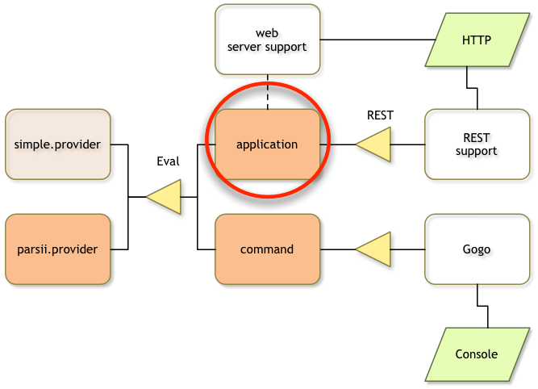
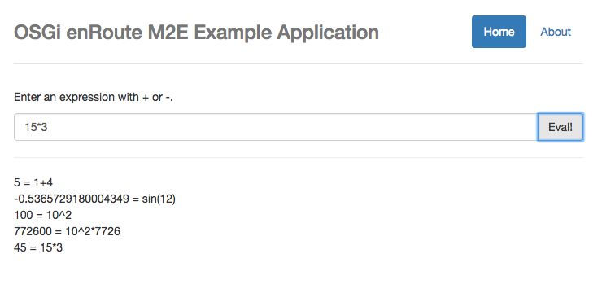
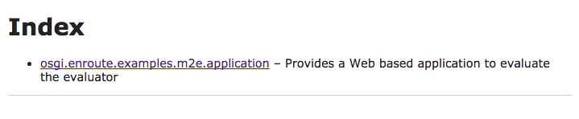

## What You Will Learn in this Section

So far we've been able to test our expression evaluator with the Gogo command shell. In
this section we create a small web application that calls the evaluator from the
web. 

We will create a small GUI in HTML 5 and Javascript based on Angular that uses
the OSGi enRoute simple REST facility to call the evaluator service.

For many Java developers, Javascript, CSS, and HTML 5 are foreign and scary. However, this example requires very little knowledge of these resources. And won't you admit that it's cool to write something you can show your girl/boy friend without getting blank stares? If you're absolutely not interested in web applications then you can skip this section.

Make sure you are in the top directory:

	$ cd ~/workspaces/osgi.enroute.examples.eval
{: .shell }

## Project

	osgi.enroute.examples.eval $ mkdir application
	osgi.enroute.examples.eval $ cd application
	application $ vi pom.xml
	// edit pom
{: .shell }

The pom for this project looks like:

	<project 
		xmlns="http://maven.apache.org/POM/4.0.0" 
		xmlns:xsi="http://www.w3.org/2001/XMLSchema-instance"
		xsi:schemaLocation="http://maven.apache.org/POM/4.0.0 http://maven.apache.org/xsd/maven-4.0.0.xsd"
	>
		<modelVersion>4.0.0</modelVersion>
		
		<parent>
			<groupId>org.osgi</groupId>
			<artifactId>osgi.enroute.examples.eval</artifactId>
			<version>1.0.0-SNAPSHOT</version>
		</parent>
		
		<artifactId>osgi.enroute.examples.eval.application</artifactId>
		<description>A web application to evaluate expressions</description>
		
		<dependencies>
			<dependency>
				<groupId>org.osgi</groupId>
				<artifactId>osgi.enroute.examples.eval.api</artifactId>
				<version>1.0.0-SNAPSHOT</version>
				<scope>compile</scope>
			</dependency>
		</dependencies>
	</project>

## The Application Java Source Code

Our application class must provide access to the expression evaluator via REST.
For this reason, there is a simple REST provider that leverages the OSGi model. The
primary purpose of this support is to make it trivially easy to call Java code
running in OSGi as a service from a Javascript application.

The secondary purpose of the application class is to act as a _root_ for the 
requirements graph. It defines a number of requirements that cannot be analyzed 
from the code. We add those requirements using annotations. These annotations
will then be converted to OSGi requirements by bnd.

	application $ mkdir -p src/main/java/osgi/enroute/examples/eval/application
	application $ vi src/main/java/osgi/enroute/examples/eval/application/EvalApplication.java
	// Add the source code
{: .shell }
	
The source code is:

	package osgi.enroute.examples.eval.application;
	
	import org.osgi.service.component.annotations.Component;
	import org.osgi.service.component.annotations.Reference;
	
	import osgi.enroute.configurer.api.RequireConfigurerExtender;
	import osgi.enroute.examples.eval.api.Eval;
	import osgi.enroute.google.angular.capabilities.RequireAngularWebResource;
	import osgi.enroute.rest.api.REST;
	import osgi.enroute.twitter.bootstrap.capabilities.RequireBootstrapWebResource;
	import osgi.enroute.webserver.capabilities.RequireWebServerExtender;
	
	@RequireAngularWebResource(resource={"angular.js","angular-resource.js", "angular-route.js"}, priority=1000)
	@RequireBootstrapWebResource(resource="css/bootstrap.css")
	@RequireWebServerExtender
	@Component(name="osgi.enroute.examples.eval")
	public class EvalApplication implements REST {
	
		@Reference
		Eval eval;
		
		public double getEval(String string) throws Exception {
			return eval.eval(string);
		}
	}

A short explanation of the annotations:

* `@RequireAngularWebResource` – Instead of listing Javascript and CSS dependencies 
  in the `index.html` file we can define what gets included with the annotation. This
  provides for a single definition of what resources should be included. This
  Angular annotation includes the angular Javascript resources.
* `@RequireBootstrapWebResource` – Includes the Bootstrap CSS
* `@RequireWebServerExtender` – The [Webserver] extender makes it easy to provide static
  context. It also provides the runtime support for the web resources.

## The GUI

We want the application to look like:

### About Angular

For many Java developers the web is a scary place. In OSGi enRoute we chose Angular
for the GUI not expecting every Java OSGi developer to jump on that band wagon (this
band wagon changes every 3 months anyway) but it allows very simple powerful and scalable
applications.

The key concept of Angular is that it updates the GUI directly from the Javascript
variables. This allows very clean separation between the business logic, the traditional model, 
and the GUI. The GUI itself is modeled with HTML 5 and also often contains logic. However,
this view/control logic should be restricted to the control and view aspects and not contain
business logic. 

### About HTML 5

Most Java developers still consider HTML to be a variant of XML. It is not, it is much
more relaxed. In many cases it is not necessary to quote attribute values and 
many tags are not required to be closed. Though this sounds offensive to people
used to XML it is actually more readable and sometimes not closing a tag
prevents accidental whitespace between tags to kill a carefully crafted layout.

## Static Web Content

The OSGi enRoute webserver bundle will map any directory named `static` in a bundle to the
web server's root. In OSGi enRoute applications, the convention is to use the fully
qualified name of the application as the root. This content is generally not accessed 
directly except for the `index.html` file in this directory. We therefore have the following 
static web resource files:

	static/
		osgi.enroute.examples.eval/
			index.html
			favicon.ico
			htm/
				main/
					about.htm
					home.htm

### index.html

The `index.html` file is the root of our Javascript application. It is an Angular
application. It uses URL based routing, this makes it slightly more complex than 
the absolute simplest Angular application but it then makes turning it into something
useful much harder.

In the `index.html` file we are using [_macros_][Macro] and/or properties. We therefore need to 
let bnd _expand_ the file. This is needed because the web resources use the Bundle
Symbolic Name and the actual version used in the bundle, which might differ slightly from
the Maven version.

The `index.html` should be stored in `src/main/resources/static/osgi.enroute.examples.eval/index.html`, this
will make it available on the web server under `/osgi.enroute.examples.eval/index.html`.

	application $ mkdir -p src/main/resources/static/osgi.enroute.examples.eval
	application $ vi src/main/resources/static/osgi.enroute.examples.eval/index.html
	// add the subsequent content
{: .shell }
	
The first part of the index.html  file is quite straightforward HTML 5 code made compatible with
the Internet Explorer quirks.

	<!DOCTYPE html>
	<html lang="en">
		<head>
			<meta charset="utf-8">
			<meta http-equiv="X-UA-Compatible" content="IE=edge">
			<!-- HTML5 shim and Respond.js IE8 support of HTML5 elements and media queries -->
			<!--[if lt IE 9]>
			      
			      
		    <![endif]-->
			<meta name="viewport" content="width=device-width, initial-scale=1">
			<meta name="description" content="">
			<meta name="author" content="">
			
			<link rel="icon" href=/osgi.enroute.examples.eval/favicon.ico">
			<title>OSGi ENROUTE EXAMPLE APPLICATION</title>

The following link will include the CSS that the application needs. The CSS (in our
case Bootstrap) was indicated by the @RequireBootstrap annotation on the application
class. The `/osgi.enroute.webresource/` URL is mapped to a servlet that will be able
to find all the required web resources for the given Bundle-SymbolicName and Bundle Version.
The ${bsn} macro and ${Bundle-Version} macro are expanded by bnd.

			<link 
				rel	="stylesheet" 
				type="text/css"
				href="/osgi.enroute.webresource/${bsn}/${Bundle-Version}/*.css"
			>
		
		</head>
	
Angular requires an `ng-app` attribute for the name of the application.

		<body ng-app="osgi.enroute.examples.eval">

We use Bootstrap to create a container for the content.
	
			

				

The first part is a navigation bar where we have our 2 views listed. The Home view is our application,
executing an expression evaluation. The second one is an About window. We use the URL
routing mechanism to go to the right view.			
				
					<ul class="nav nav-pills pull-right">
						<li 
							ng-class="{active: page() == '/'}">
								<a href="#/">Home</a>
						<li ng-class="{active: page() == '/about'}">
							<a href="#/about">About</a>
					</ul>
					
					<h3 
						class="text-muted">
							OSGi enRoute Example Application
					</h3>

A simple alert area. This allows us to report errors like communication errors. We add
a close button to remove the alerts one by one.
					
					

						
						
						{{alert.msg}}
						
						<button 
							type="button" 
							ng-click='closeAlert($index)' 
							class="close pull-right">
							&times;Close
						</button>
					

					
				

This is the Angular magic. This element will be replaced by the content (`htm/main/home.htm` or `htm/main/about.htm`)
depending on the URL.
		  		
		  		

		  		
  	

A simple footer. If you set the Bundle-Vendor header in the bnd.bnd file then it will be used here. Otherwise
it will use the generic `Company` title. Also note how we can use the build time stamp. You can use
any bnd [Macro].
		
				

					
&copy; ${def;Bundle-Vendor;Company} ${tstamp;YYYY}

				

		
			

This is where the magic happens for Javascript web resources. We include any resource that ends
with .js that has been required by the bundle. At the end, also the content of the `web` directory
in the bundle is appended.  

			
	
		</body>
	</html>

To replace the bnd macros with their value we must tell bnd to pre-process the resource. We therefore
need to create a bnd.bnd file:

	application $ vi bnd.bnd
	// Add content
{: .shell }

This  requires the following line in the `bnd.bnd` file:

	-includeresource: \
		{static/osgi.enroute.examples.eval/index.html=src/main/resources/static/osgi.enroute.examples.eval/index.html}

## The Views

The app has two views. They are stored in `src/main/resources/static/osgi.enroute.examples.eval/main/htm`.

	application $ mkdir -p src/main/resources/static/osgi.enroute.examples.eval/main/htm
{: .shell }

## Home

The `home.htm` is the main view.

	application $ vi src/main/resources/static/osgi.enroute.examples.eval/htm/main/home.htm
	// add the content
{: .shell }

It looks like:

	<section 
		ng-cloak 
		style="min-height:500px">
	
		
Enter an arithmetic expression like <code>sin(pi)</code>
		
		

The input field for the expression.
			
		   <input 
		   	type="text" 
		   	ng-model=expression 
		   	class="form-control">
		   		
		        <button class="btn btn-default" type="button" ng-click=eval(expression)>
		        	Eval!
		        </button>
		   
		

		
		

		
		

Prints all the answers
		
			

				
				{{i}}
				
			

			
		

	</section>

## About

A simple about box.

	application $ vi src/main/resources/static/osgi.enroute.examples.eval/htm/main/about.htm
	// add the content
{: .shell }

	<section>
		<h1>About</h1>
		
This is a demo application to demonstrate how to build OSGi enRoute Applications with 
		Maven/M2E
		

	</section>

## The Javascript Code

The Javascript code must be placed in a directory in the `src/resources/main/web`. Any
content in this directory is treated as a web resource and automatically included
in the `index.html` page. The name of the files is irrelevant but the extension is
since the selection in the index.html file takes place on extension.

	application $ mkdir -p src/main/resources/web
{: .shell }

### main.js

	application $ vi src/main/resources/web/main.js
	// add the content
{: .shell }

We create a Javascript 'module'. This is an anonymous function.

	'use strict';
	(function() {

We now create an Angular module. The name of the module must match the `ng-app`
attribute in the `index.html` file. 

		var MODULE = 
			angular.module('osgi.enroute.examples.eval', [ 'ngRoute' ] );
	
The next section configures the routing table. The routing table matches a pattern
in the URL and then selects the content of the `ng-view` element in the `index.html`
page.

		MODULE.config( function($routeProvider) {
			$routeProvider.when('/', { controller: mainProvider, templateUrl: '/osgi.enroute.examples.eval/htm/main/home.htm'});
			$routeProvider.when('/about', { templateUrl: '/osgi.enroute.examples.eval/htm/main/about.htm'});
			$routeProvider.otherwise('/');
		});

Initialize when the module is ready to run. We add the data structure to hold the alerts and provide
access to the current page name for the nav bar.
		
		MODULE.run( function($rootScope, $location) {
			$rootScope.alerts = [];
			$rootScope.closeAlert = function(index) {
				$rootScope.alerts.splice(index, 1);
			};
			$rootScope.page = function() {
				return $location.path();
			}
		});

A list of answers, i.e. the history.
		
		var answers = [ ];

This _controller_ is called when the URL ends in `#home`. We set the history and add
an `eval` method. This method will call the server. If we receive an answer, we
add it to the history. Angular will then make sure it gets printed.
		
		var mainProvider = function($scope, $http) {
			$scope.answers=answers;
			
			$scope.eval = function(expr) {
					$http.get('/rest/eval/'+expr).then(
							function(d) {
								answers.push(d.data + " = " + expr);
							}, function(d) {
								$scope.alerts.push( { type: 'danger', msg: 'Failed with ['+ d.status + '] '+ d.statusText });
							}
					);
			}
		}
		
	})();

## Building

You should add the application module to the parent pom and then build the bundle:

	application $ vi ../pom.xml
	// add application module
	application $ mvn install
	...
{: .shell }

## Running
 
To run this application we need to add this bundle to the bndrun file. This requires
the following steps in the bndrun project.

	application $ cd ../bndrun
	bndrun $ vi pom.xml
	// edit the dependencies section
{: .shell }

The dependencies section should look like:

	<dependencies>
		<dependency>
			<groupId>org.osgi</groupId>
			<artifactId>osgi.enroute.examples.eval.parsii.provider</artifactId>
			<version>1.0.0-SNAPSHOT</version>
		</dependency>
		<dependency>
			<groupId>org.osgi</groupId>
			<artifactId>osgi.enroute.examples.eval.command</artifactId>
			<version>1.0.0-SNAPSHOT</version>
		</dependency>		
		<dependency>
			<groupId>org.osgi</groupId>
			<artifactId>osgi.enroute.examples.eval.application</artifactId>
			<version>1.0.0-SNAPSHOT</version>
		</dependency>		
	    <dependency>
	            <groupId>org.osgi</groupId>
	            <artifactId>osgi.enroute.pom.distro</artifactId>
	            <version>2.0.0</version>
	    </dependency>
		<dependency>
		    <groupId>org.apache.felix</groupId>
		    <artifactId>org.apache.felix.gogo.shell</artifactId>
		    <version>1.0.0</version>
		</dependency>
	</dependencies>

Then add the new `-runrequires` for the application:

	bndrun $ vi osgi.enroute.examples.eval.bndrun
	// Update -runrequires
{: .shell }

	-runrequires: \
		osgi.identity;filter:='(osgi.identity=osgi.enroute.examples.eval.parsii.provider)',\
		osgi.identity;filter:='(osgi.identity=org.apache.felix.gogo.shell)',\
		osgi.identity;filter:='(osgi.identity=org.apache.felix.gogo.command)',\
		osgi.identity;filter:='(osgi.identity=osgi.enroute.examples.eval.command)',\
		osgi.identity;filter:='(osgi.identity=osgi.enroute.examples.eval.application)'

Then run `mvn install` to get the new list of `-runbundles`. This will give us a much larger
list because we now get all the web support:

	bndrun $ mvn install
	...
	-runbundles: \
		org.apache.felix.configadmin;version='[1.8.8,1.8.9)',\
		org.apache.felix.gogo.command;version='[0.16.0,0.16.1)',\
		org.apache.felix.gogo.runtime;version='[0.16.2,0.16.3)',\
		org.apache.felix.log;version='[1.0.1,1.0.2)',\
		org.apache.felix.scr;version='[2.0.2,2.0.3)',\
		org.eclipse.equinox.metatype;version='[1.4.100,1.4.101)',\
		org.osgi.service.metatype;version='[1.3.0,1.3.1)',\
		osgi.enroute.examples.eval.command;version='[1.0.0,1.0.1)',\
		osgi.enroute.examples.eval.parsii.provider;version='[1.0.0,1.0.1)',\
		org.apache.felix.gogo.shell;version='[2.0.0,2.0.1)',\
		org.apache.felix.http.jetty;version='[3.2.0,3.2.1)',\
		org.apache.felix.http.servlet-api;version='[1.1.2,1.1.3)',\
		org.eclipse.equinox.coordinator;version='[1.3.100,1.3.101)',\
		org.eclipse.equinox.event;version='[1.3.100,1.3.101)',\
		org.osgi.service.event;version='[1.3.1,1.3.2)',\
		osgi.enroute.configurer.simple.provider;version='[2.0.0,2.0.1)',\
		osgi.enroute.dtos.bndlib.provider;version='[2.0.0,2.0.1)',\
		osgi.enroute.examples.eval.application;version='[1.0.0,1.0.1)',\
		osgi.enroute.executor.simple.provider;version='[1.0.0,1.0.1)',\
		osgi.enroute.google.angular.webresource;version='[1.5.7,1.5.8)',\
		osgi.enroute.logger.simple.provider;version='[2.0.0,2.0.1)',\
		osgi.enroute.rest.simple.provider;version='[2.0.0,2.0.1)',\
		osgi.enroute.twitter.bootstrap.webresource;version='[3.3.5,3.3.6)',\
		osgi.enroute.web.simple.provider;version='[2.0.0,2.0.1)'
	...
{: .shell }

Add the new `-runbundles` to the `bndrun` file and run `mvn install` again.

	bndrun $ vi osgi.enroute.examples.eval.bndrun
	// Update the -runbundles
	bndrun $ mvn install
	...
	bndrun $ java -jar osgi.enroute.examples.eval.jar
	2016-10-04 11:44:50.960:INFO::main: Logging initialized @673ms
	2016-10-04 11:44:50.989:WARN:oejs.session:main: Sessions created by this manager are immortal (default maxInactiveInterval={})0
	2016-10-04 11:44:50.992:INFO:oejs.Server:main: jetty-9.3.8.v20160314
	2016-10-04 11:44:51.029:INFO:oejsh.ContextHandler:main: Started o.e.j.s.ServletContextHandler@1757cd72{/,null,AVAILABLE}
	2016-10-04 11:44:51.030:INFO:oejs.Server:main: Started @742ms
	2016-10-04 11:44:51.049:INFO:oejs.ServerConnector:main: Started ServerConnector@68c72235{HTTP/1.1,[http/1.1]}{0.0.0.0:8080}
	             ____             _       
	   ___ _ __ |  _ \ ___  _   _| |_ ___ 
	  / _ \ '_ \| |_) / _ \| | | | __/ _ \
	 |  __/ | | |  _ < (_) | |_| | |_  __/
	  \___|_| |_|_| \_\___/ \__,_|\__\___|
	              http://enroute.osgi.org/
	
	              
	G! 	
{: .shell }

The output from Gogo and the log can be garbled.

We can now open a browser on [http://localhost:8080/osgi.enroute.examples.eval](http://localhost:8080/osgi.enroute.examples.eval) 

What we get is the home page of our application, with a text entry field to try out the expression evaluator! 

## Index

If you go to the root of the webserver you get an empty page. It is possible to get the active web application(s) listed here. 
For this, we need to add some metadata to the application project.

	bndrun $ cd ../application
	application $ vi bnd.bnd
	// Add the following content
{: .shell }

	Bundle-Description: \
		Provides a Web based application to evaluate the evaluator
		
	EnRoute-Application: 	osgi.enroute.examples.eval

    -includeresource: \
       {static/osgi.enroute.examples.eval/index.html=\
       	src/main/resources/static/osgi.enroute.examples.eval/index.html}

If we now build and then run again then we should see the application
listed on the home page.

	application $ mvn install
	...
	application $ cd ../bndrun
	bndrun $ mvn install
	bndrun $ java -jar osgi.enroute.examples.eval.jar
	...

This list is created  by the web server if nothing else
is registered at the root. This list looks like:

Click on the link and you should get the application in the browser.

We can now open a browser on [http://localhost:8080](http://localhost:8080) to try this out. 

[Webserver]: /services/osgi.enroute.webserver.capabilities.html
[Configurer]: /services/osgi.enroute.configurer.api.html
[Macro]: http://bnd.bndtools.org/chapters/850-macros.html
