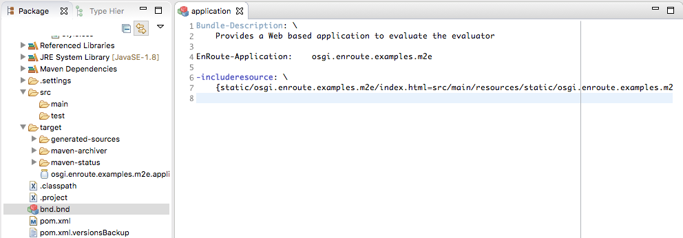
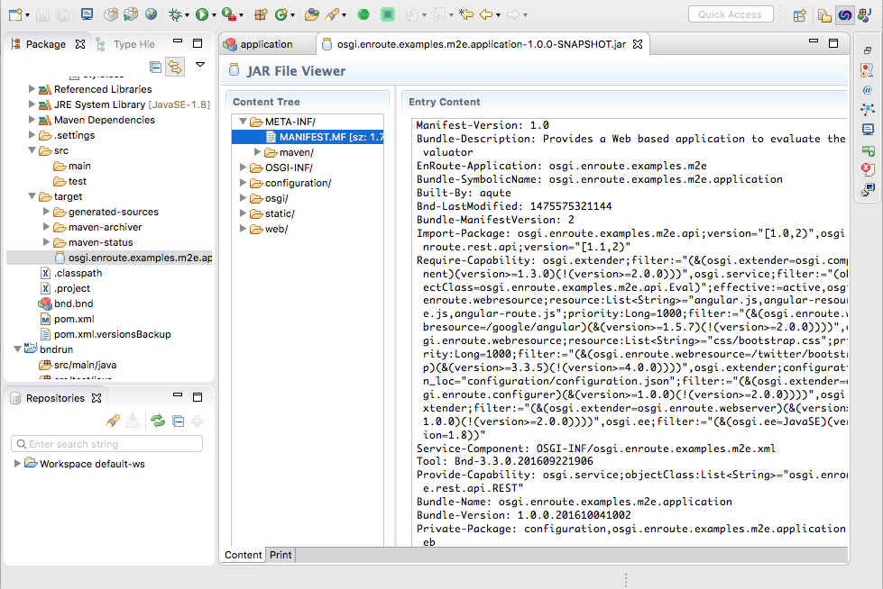
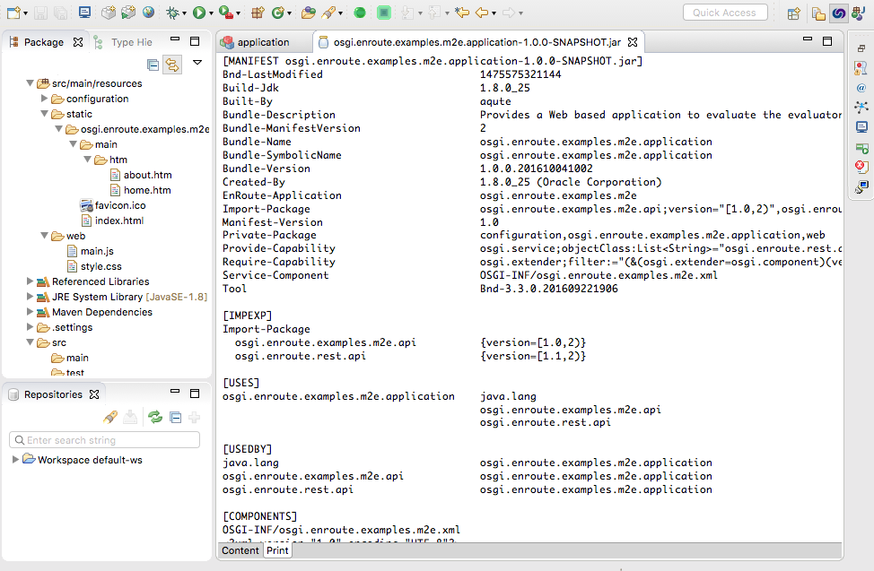
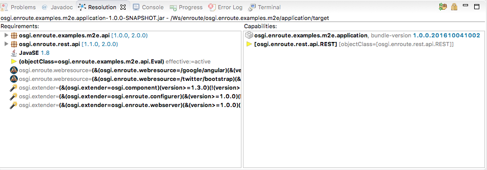
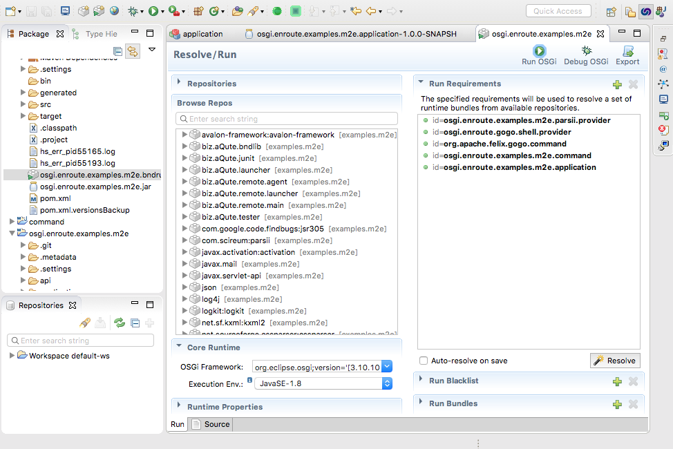
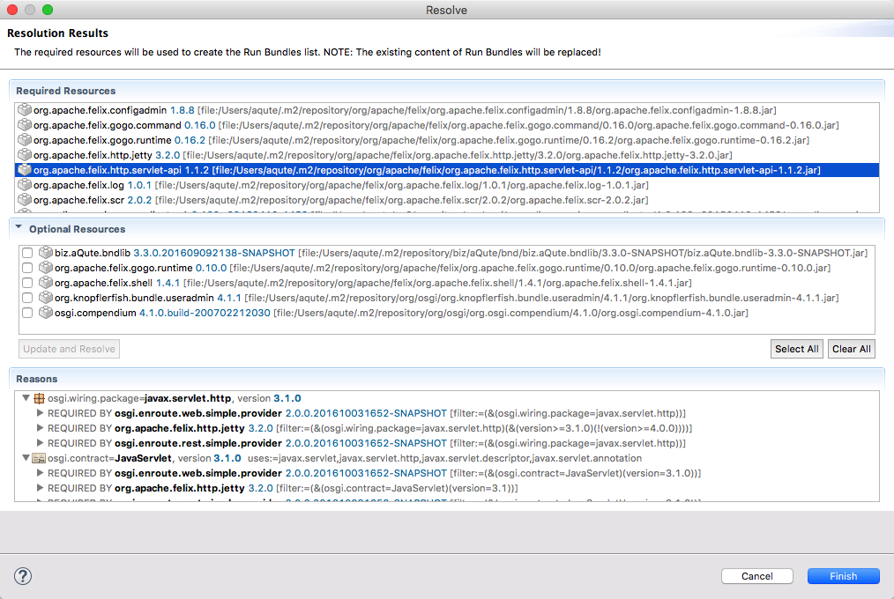

## What You Will Learn in this Section

In this section we will go through the support Eclipse provides to help you
develop bundles with maven. It shows how to use the Bndtools editors for 
the bnd and bndrun files as well as how to debug your code.

It is assumed you have setup your Eclipse and installed Bndtools. You can
look at the [Quick Start](/qs/100-prerequisites.html) how to setup your
environment. M2Eclipse is generally already installed in Eclipse.

Though we need to install Bndtools for this section, we only use the editors
standalone. You should not make the projects Bndtools projects.

## M2Eclipse

If you use Maven and Eclipse then M2Eclipse is the best solution for OSGi
enRoute development. It allows you to create an Eclipse workspace with projects
that can reside anywhere on the file system. 

This tutorial clearly cannot teach M2Eclipse, there are other sources for that.

## The bnd Editor

If you double click on a bnd file then it will open a bnd editor when Bndtools is installed
in Eclipse. The most important tab on this editor is the Source tab. This editor
provides syntax coloring and completion as well as tool tips on instructions and
headers. An important function of the bnd editor is to notice when you use
spaces after a backslash that was intended to be used as a line ending. The 
editor will recognize many error situations and warn you early.

The Content Tab and the Description tab are mostly working when used in stand-alone
mode. In the Content tab, the imports will not be calculated if the bnd.bnd does
not reside in a Bndtools project. However, you can still drag packages to the
Private-Package or Export-Package list and/or customize imports. 

The Build, Run and Test tabs are only working in Bndtools projects. 

## The JAR Viewer

If you double click on a JAR file then you will open by default the Bndtools
JAR editor. This editor has a Content and a Print tab.

The Content tab is a list of the content. You can browse the manifest and other files.

The Print Tab is the output of an analysis by bnd. It shows the manifest information
and DS information in more detail and more readable form.

## The Resolution Viewer

If you open the `Resolution` view (`Window/Show View/Bndtools/Resolution`) then
it will track the selection. If you select a JAR file it will analyze this 
JAR file and show the capabilities and requirements in a more readable form than
is used in the manifest.

Especially useful are the packages requirements. You can see the import range
that was calculated but also by opening up these lines you 
can see the classes that caused that requirement.

## The Bndrun Editor

The Bndrun editor has two tabs. First there is the source tab. This tab is
basically the same as the bnd editor. It provides completion, highlighting
and detection of errors when you create malformed properties.

The Run tab is another beast, it can be very useful for editing the bndrun
files because it shows the possible dependencies. These dependencies can be
filtered and with drag and drop added to the `-runrequires` instruction.
With a button click, this list can then be resolved. The resolution can then
be inspected to handle optionals (these are listed seperately) and to analyze
where certain bundles come from. 

The Bndrun editor can also launch the application standalone or in the debugger.
This does not support dynamic update for code changes, you still have to install
the project before you see the updates.

### Resolving

If you double click on the `osgi.enroute.examples.eval.bndrun` file in the `bndrun`
directory then you open the Bndrun editor. You should select the `Run` tab.

The list of bundles you can see in the `Browse Repos` list is calculated from the
`pom.xml` file in the `bndrun` directory. (This is the Bnd Pom Repository plugin
definition.) You can drag bundles in this list and drop them on the `Run Requirements`
list. 

The parsed result is saved in the `target/cache.xml` file
to speed things up. Changes in the `pom.xml` are detected but if you make more
overall changes you should clean the project with maven to remove the cached
file because these changes cannot be detected.
{: .note }

Below the `Browse Repos` list you can set the framework, the execution environment
and the runtime properties. This should be self explanatory.

Once the initial requirements are set you can click on the `Resolve` button. 
This will open a window (sometimes after some time) with the resolution:

The result shows the required resources based on the initial requirements in the
top list. It then shows any _optional_ resources. These are resources that are included
because the resolution is ok without them but some resources could use them. You
can select the desired resources and then update and resolve.

When you select a resource in the top list, the bottom list shows an explanation
why that resource is included. That is, what resources required it.

When you click `Finish` the `-runbundles` list is updated and the bnd.bnd file
is saved.

This works considerably faster and is more elegant than running `mvn install`,
get the new `-runbundles` and update the bndrun file. However, it does require
Eclipse.

### Debugging

On the right top of the Bndrun editor in the `Run` tab there are three buttons:

* `Run OSGi` – Launch the application.
* `Debug OSGi` – Launch the defined application in the debugger
* `Export` – Export the application to an executable JAR with all its dependencies

M2Eclipse continuously compiles and runs some of the plugins but will not
JAR the result. This means that you need to do a `mvn install` to update the
bundles in the `~/.m2/repository`. When you run your framework with support
of the Bndrun editor then you should be aware that Eclipse updates your code
in the VM when you change the source but it does not create a new bundle. The changes
you see are also only for the class files. It will not see updates to the
resources. This is a very different experience from Bndtools that synchronizes all
the updates continuously.

This means that if you're working in Eclipse you have to be quite aware of the
state of the different projects. In general, after you've made a change you should
do a full clean install of that project. 

When you install, the Maven JAR plugin overwrites the existing file. This can
cause a core dump in the JVM.
{: .note }
  

[M2Eclipse]: http://www.eclipse.org/m2e/
 