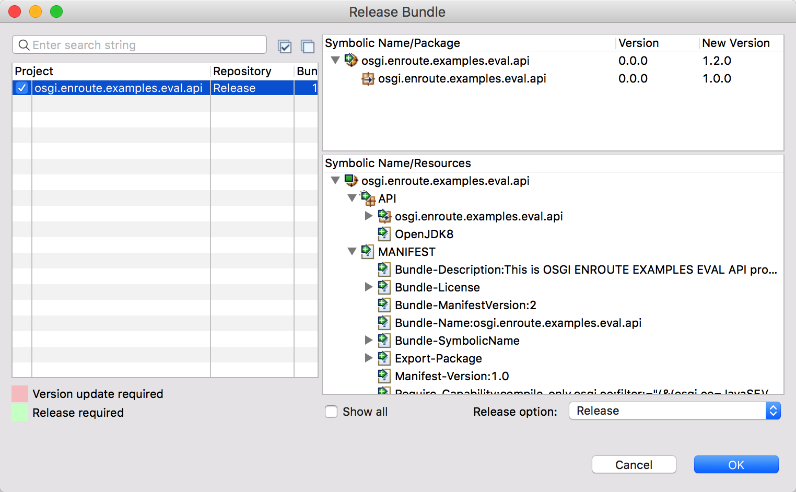
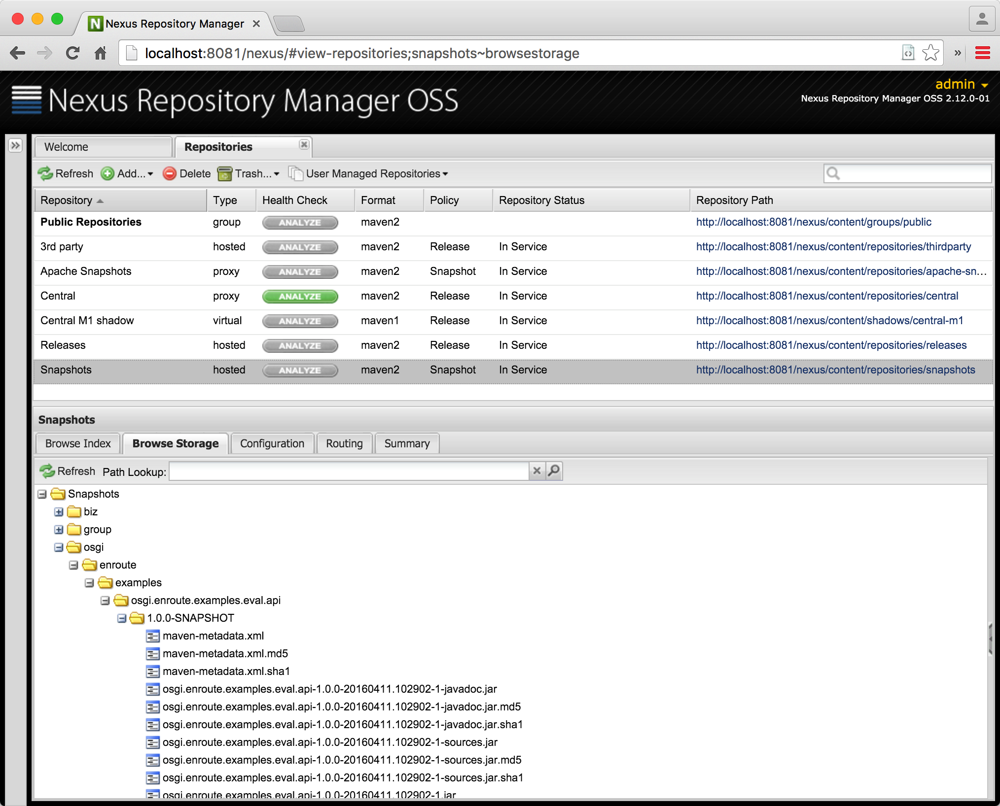

In this section we're going to setup releasing snapshots to a Nexus server.

## Setting up Nexus

We are not going to explain how to setup a Nexus repository because you probably already have a Nexus running or you can [install it according to its instructions](https://books.sonatype.com/nexus-book/reference/install.html).

In the following sections we assume that:

* There is a default Nexus running on http://localhost:8081 . This Nexus should have a snapshot and release repository setup:
	* http://localhost:8081/nexus/content/repositories/snapshots/
	* http://localhost:8081/nexus/content/repositories/releases/
* It has an account setup called `admin` with the password `admin123`. (Default account.)

You should translate these settings to your local setup.

## Communications

The [-connection-settings] instruction defines the communication settings to the Nexus repository. By default, bnd looks in the `~/.bnd/settings.xml` and then `~/.m2/settings.xml`. The bnd settings are compatible with the Maven settings. However, it is also possible to override the location of the settings in the `build.bnd` file, which we do here.

	-connection-settings: ${.}/settings.txt

And in `./cnf/settings.xml`:

 	<settings xmlns="http://maven.apache.org/SETTINGS/1.0.0"
		xmlns:xsi="http://www.w3.org/2001/XMLSchema-instance"
		xsi:schemaLocation="http://maven.apache.org/SETTINGS/1.0.0
	                          http://maven.apache.org/xsd/settings-1.0.0.xsd">
		<servers>
			<server>
				<id>http://localhost:8081</id>
				<username>admin</username>
				<password>admin123</password>
			</server>
		</servers>
	</settings>

In bnd, the id is not the name of the repository but it must match the scheme, host, and port number.

You can copy the settings file in the example project to your `~/.bnd/settings.xml` file if you need to modify it with private credentials. (In general, it is a pretty bad idea to place credentials in a bnd workspace.)

## The Release Repository

We now need to link the Release repository to the Nexus repository, so we need to modify the Release repository plugin by adding a snapshot and release URL:

	-plugin.9.Release: \
	\
        aQute.bnd.repository.maven.provider.MavenBndRepository; \
        	releaseUrl			=   http://localhost:8081/nexus/content/repositories/releases/ ; \
        	snapshotUrl			=   http://localhost:8081/nexus/content/repositories/snapshots/ ; \
			name				=	Release

Notice that also in this case we override the OSGi enRoute Release plugin by using the `-plugin.9.Release` name.

The OSGi enRoute setup already has the [-releaserepo] setup to point to a repository named Release. Since we've overwritten it, the Maven Bnd Repository will do the release work.

## Releasing Snapshots

Once this repository is setup we can release to the Release repository from the GUI. In general this is not such a good idea but we show it here because it is a good way to play with the system to understand better how it all interacts. A professional setup would **only** release from a Continuous Integration server that checks out a clean workspace from a source control management system. We discuss this setup in the next section.

In Bndtools you can select a project or the `bnd.bnd` file and call up a context menu. Let's do this for the API project, one of our colleagues wants to use the API.  In the context menu you will see an entry: `Release Bundle`. This opens up a window that allows you to check the bundle's status against the released version. 

You can then select the bundle. This tool is made to do the actual release, which then requires updating of the versions of our bundle. In this case, we just want to release a snapshot. Therefore, select the `Release Option` menu at the left bottom and select `Release`. Click `OK`.

We're now sending a snapshot to the Nexus repository. If something goes wrong (there are quite a few moving parts) then the error is reported to you. Otherwise you should see a dialog that you've just released a new snapshot to the Release repository.

The GUI does not report errors very well, actually it almost swallows them. We're working on it. In the mean time you can select the line with the message, copy it, open an `Untitled Text File` in Eclipse, and then paste it.
{: .bug }

If you go to the Nexus GUI then you can verify that the API is now available in the snapshot repository.

