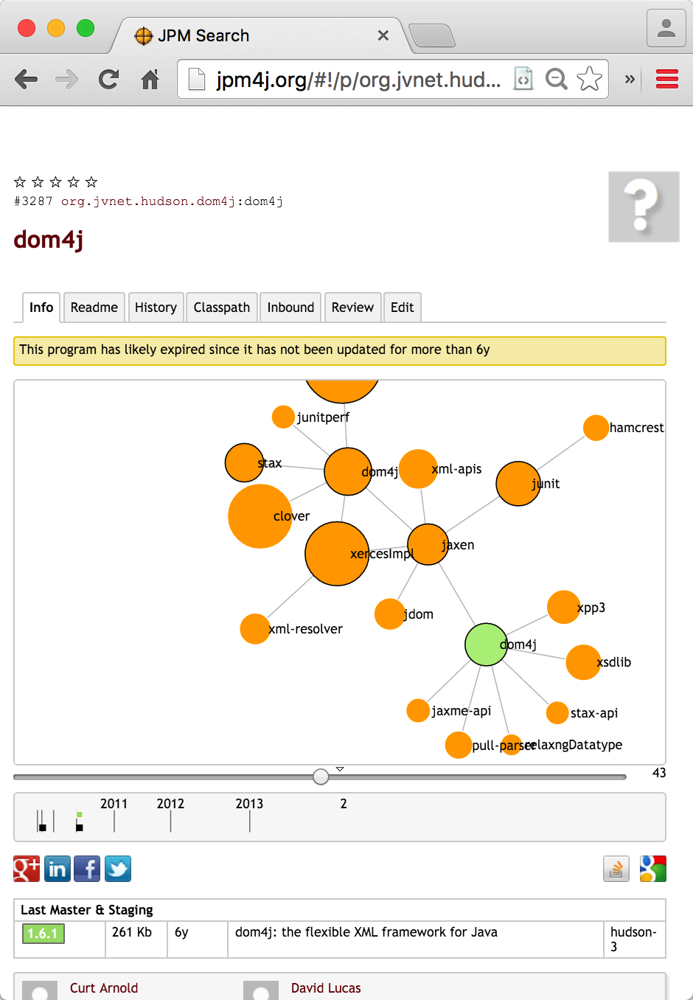

This tutorial is under review. Feedback appreciated (PRs on [Github](https://github.com/osgi/osgi.enroute.site/pulls))
{: .note }

{: .thumb200-l }

OSGi developers face a challenge when using third-party libraries that are not supplied as OSGi bundles. Though an increasing number of libraries are available from their original sources as OSGi bundles, and a large number are available as wrapped OSGi bundles from external repositories, it is still sometimes necessary to build such a wrapper ourselves. This tutorial details an approach to OSGi bundle production using bnd/bndtools/gradle. 

In this quick start we learn how to _wrap_ a JAR to become a Bundle. Wrapping a JAR means that we need add the required OSGi manifest headers but also _design_ the contents of the bundle. Modularity is not about fences, modularity is about what you put inside those fences and what passages you allow. The bnd tool provides an overwhelming amount of instructions and features to create the Bundle you want; this tutorial tries to shine light on what forces are in play and what tools are available.

This tutorial teaches the wrapping from the perspective of a Bndtools user. For any command line zealots this should not be too hard to map to `vi` since all we do is write a `bnd.bnd` file in Bndtools, which is also usable in for example Maven. The key advantage of Bndtools is that it shows you the missing packages interactively. If you want to stay on the command line, then you could take a look at [bnd Wrapping](http://bnd.bndtools.org/chapters/390-wrapping.html).

In the coming chapters it is assumed you have a workspace ready. If you've no clue what we're talking about suggest you follow the [Quick Start Tutorial](http://enroute.osgi.org/qs/050-start.html) first.

A disclaimer. This wrapping tutorial is about learning to use wrapping bundles inside the OSGi enRoute tool chain, it is not about learning Java, Git, nor Eclipse. It is assumed that you have basic experience with these tools and that you have at least followed the [Quick Start] tutorial.

If you're just interested in the end result, you can look at the [osgi.enroute.examples.wrapping.dom4j.adapter](https://github.com/osgi/osgi.enroute.examples/tree/master/osgi.enroute.examples.wrapping.dom4j.adapter) project.

If you have any questions about this wrapping tutorial, please discuss them in the [Forum].

## Sections

<table>
	<colgroup>
		<col style="width:50%">
		<col style="width:50%">
	</colgroup>
	<tbody>
<tr><td><a href="{{qs.url}}">{{qs.title}}</a></td><td>{{qs.summary}}</td></tr>

	</tbody>
</table>

## End

So, you've finished this wrapping tutorial! What's next?

Well, first, since we're still in beta, we'd love feedback. Our most favorite feedback is a pull request on the documentation. As an early user you must have run into some rough edges, outright stupidities, or you had a brilliant idea. Just go to the [OSGi enRoute][enroute-doc] repository on Github. Clone it in your own account, make your changes or additions, and send a pull request. We, and others like you, highly appreciate these kind of contributions.

If you've become interested in what bnd can do for you, then you could look at the [wrapping with bnd] chapter in the bnd manual.

However, running into real problems is the best way to learn a technology. If you run into problems, use the [Forum][forum] to ask questions and get answers.

[forum]: /forum.html
[enroute-doc]: https://github.com/osgi/osgi.enroute.site

[Quick Start]: /tutorial_qs/050-start
[wrapping with bnd]: http://bnd.bndtools.org/chapters/390-wrapping.html
[DOM4J]: http://jpm4j.org/#!/p/org.jdom/jdom
[JPM4J]: http://jpm4j.org/
[-conditionalpackage]: http://bnd.bndtools.org/instructions/conditionalpackage.html
[blog]: http://njbartlett.name/2014/05/26/static-linking.html
[133 Service Loader Mediator Specification]: http://blog.osgi.org/2013/02/javautilserviceloader-in-osgi.html
[semanticaly versioned]: http://bnd.bndtools.org/chapters/170-versioning.html 
[135.3 osgi.contract Namespace]: http://blog.osgi.org/2013/08/osgi-contracts-wonkish.html
[BSD style license]: http://dom4j.sourceforge.net/dom4j-1.6.1/license.html
[supernodes of small worlds]: https://en.wikipedia.org/wiki/Small-world_network
[OSGiSemVer]: https://www.osgi.org/wp-content/uploads/SemanticVersioning.pdf
[osgi.enroute.examples.wrapping.dom4j.adapter]: https://github.com/osgi/osgi.enroute.examples/osgi.enroute.examples.wrapping.dom4j.adapter