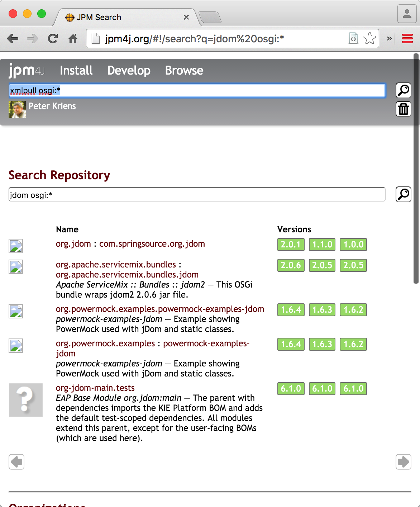

Before we continue we must raise the question: "Do you really need that dependency?" In the software world we have an abundance of open source projects that provide us with almost any desired functionality today. The fact that a JAR is not _OSGified_ is actually a warning sign because adding the minimal OSGi headers requires very little work. Almost all successful open source libraries nowadays include OSGi support out of the box.  

The second warning sign you should be aware off is the sheer number of dependencies. If your target JAR has > ±10 external dependencies then you should seriously consider skipping it if it is anyway possible. Though it is okay for applications to have this many dependencies, it is _extremely_ painful to have a component with such a large fan out. Not only are such dependencies tedious, over time they tend to become an unsolvable problem because the dependencies of this component start to constraint your own dependencies. 

A good component is highly _cohesive_ and has minimal (preferably API based) dependencies.

The third thing to consider is that OSGi is not about class loading; it is about _services_. The highest value in OSGi lies in its service model. With the service model it is possible to keep virtually all implementation details hidden inside the bundle. Unfortunately, writing service oriented bundles is an architectural aspect; it is hard to add this in general to a JAR that is written to reside on the class path and thrive on class loader hacks.

And we hardly dare to raise the issue, did someone already provide the wrapped bundle for you? 

One way to find out is to use [JPM4J]. You can search for keywords and limit them to OSGi bundles. For example, search on: [`jdom osgi:*`](http://jpm4j.org/#!/search?q=jdom%20osgi:*) and you see all bundles that are at least related to JDOM but that are OSGi ready. JPM4J has many more [search options](http://jpm4j.org/#!/md/search).

{: width="70%"}

There are some resources on the net that provide wrapped bundles:

* [Eclipse Orbit](http://www.eclipse.org/orbit) – An Eclipse repository with OSGi bundles derived from open source projects.
* [SpringSource Enterprise Repository](http://ebr.springsource.com/repository/app/) – Unfortunately this is quite stale but still contains some interesting bundles
* [Amdatu](http://repository.amdatu.org/dependencies/) – Amdatu maintains a set of dependencies that are bundles

Ok, you're still here ... So I guess the need is dire. Let's see how we can wrap an existing bundle.

[DOM4J]: http://jpm4j.org/#!/p/org.jdom/jdom
[JPM4J]: http://jpm4j.org/
[-conditionalpackage]: http://bnd.bndtools.org/instructions/conditionalpackage.html
[blog]: http://njbartlett.name/2014/05/26/static-linking.html
[133 Service Loader Mediator Specification]: http://blog.osgi.org/2013/02/javautilserviceloader-in-osgi.html
[semanticaly versioned]: http://bnd.bndtools.org/chapters/170-versioning.html 
[135.3 osgi.contract Namespace]: http://blog.osgi.org/2013/08/osgi-contracts-wonkish.html
[BSD style license]: http://dom4j.sourceforge.net/dom4j-1.6.1/license.html
[supernodes of small worlds]: https://en.wikipedia.org/wiki/Small-world_network
[OSGiSemVer]: https://www.osgi.org/wp-content/uploads/SemanticVersioning.pdf
[osgi.enroute.examples.wrapping.dom4j.adapter]: https://github.com/osgi/osgi.enroute.examples/osgi.enroute.examples.wrapping.dom4j.adapter