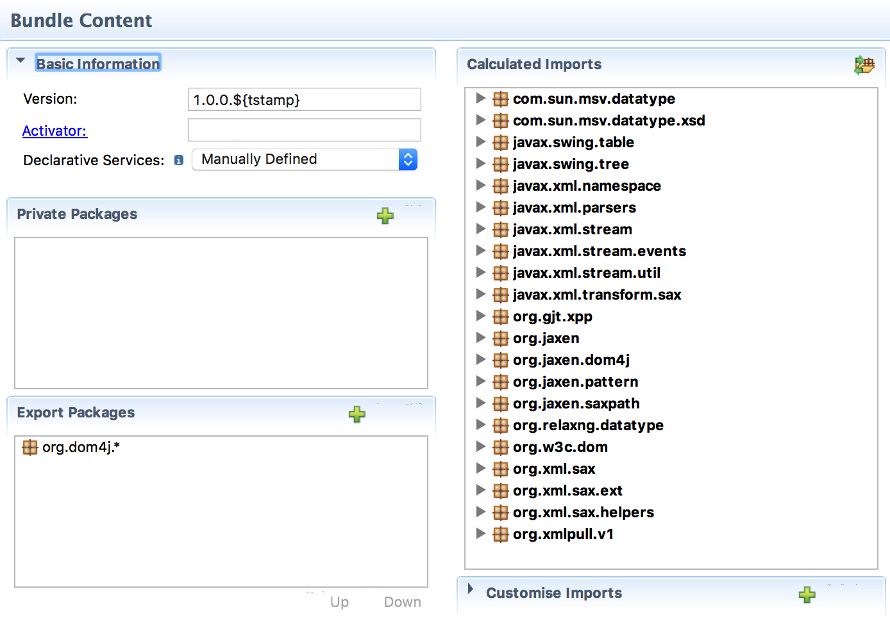
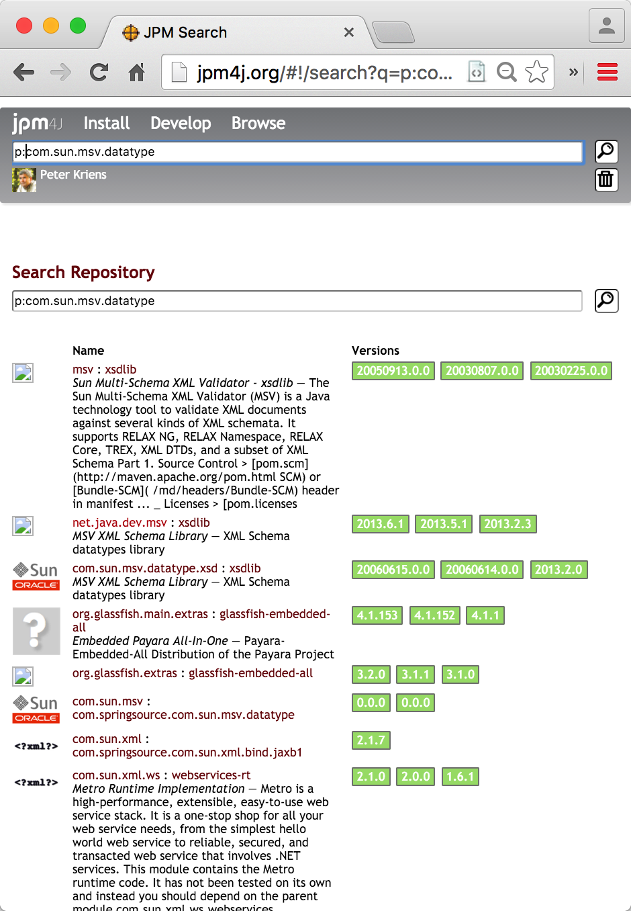
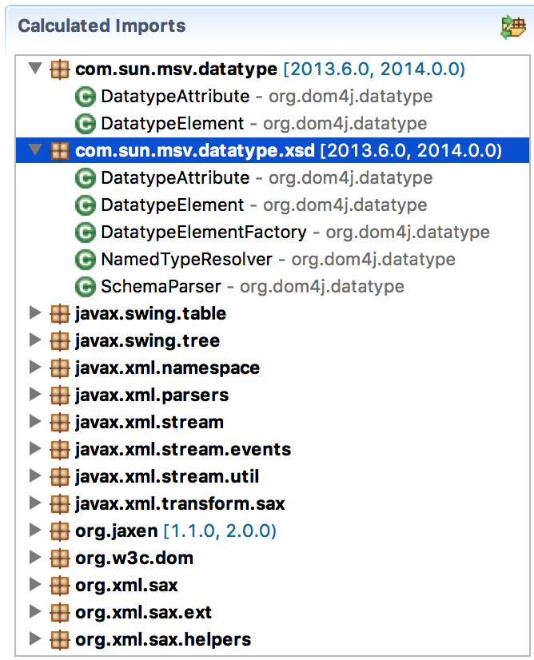

Click on the `bnd.bnd` file and select the `Contents` tab. You will see the exports listed in the `Export Packages` list and the `Calculated Imports` the list of actual imports. Clearly we're missing a few files on the `-buildpath`.

{: width="70%" }

Let's start with the first non-JVM dependency: `com.sun.msv.datatype`. We can search this on JPM4J with the `p:` modifier. You can find all JARs on [JPM4J that contain `p:com.sun.msv.datatype`](http://jpm4j.org/#!/search?q=p:com.sun.msv.datatype). 

{: width="70%" }

Obviously we have a choice here ... You will have to use external information, common sense, and some luck to get the right one. Unfortunately the rest of the world does not organize packages very well. This uncertainty is one of the main reasons why this process is so tedious.

Let's pick the [ net.java.dev.msv : xsdlib @ 2013.6.1](http://jpm4j.org/#!/p/sha/280F7C45AAEC5102CC756D1AFDB416B7775F2EF4//0.0.0) and add it to our build path.

For the `bnd.bnd` file select the `Build` tab and then drop the version vignette on the `Build Path` list. (Remember the bug, might cause it to take a bit, working on it.) If you save the `bnd.bnd` file and look at the `Source` tab then you should have the following `-buildpath`:

	-buildpath: \
		org.jvnet.hudson.dom4j__dom4j;version=1.6.1.hudson-3,\
		net.java.dev.msv.xsdlib;version=2013.6.1

And if you go to the `Content` tab you will see that the `com.sun.msv.datatype` and `com.sun.msv.datatype.xsd` now have an import version range applied to it `\[2013.6.1,2014)`. This version range is calculated by bnd from the exported version of that package by the `net.java.dev.msv.xsdlib;version=2013.6.1` bundle. (It is actually a bundle!)

{: width="70%" }

However, it is still a dependency. This raises the choice of _dependending_ on that dependency or including it? We will handle all cases, but first lets include ALL our dependencies.

We did!

[DOM4J]: http://jpm4j.org/#!/p/org.jdom/jdom
[JPM4J]: http://jpm4j.org/
[-conditionalpackage]: http://bnd.bndtools.org/instructions/conditionalpackage.html
[blog]: http://njbartlett.name/2014/05/26/static-linking.html
[133 Service Loader Mediator Specification]: http://blog.osgi.org/2013/02/javautilserviceloader-in-osgi.html
[semanticaly versioned]: http://bnd.bndtools.org/chapters/170-versioning.html 
[135.3 osgi.contract Namespace]: http://blog.osgi.org/2013/08/osgi-contracts-wonkish.html
[BSD style license]: http://dom4j.sourceforge.net/dom4j-1.6.1/license.html
[supernodes of small worlds]: https://en.wikipedia.org/wiki/Small-world_network
[OSGiSemVer]: https://www.osgi.org/wp-content/uploads/SemanticVersioning.pdf
[osgi.enroute.examples.wrapping.dom4j.adapter]: https://github.com/osgi/osgi.enroute.examples/osgi.enroute.examples.wrapping.dom4j.adapter