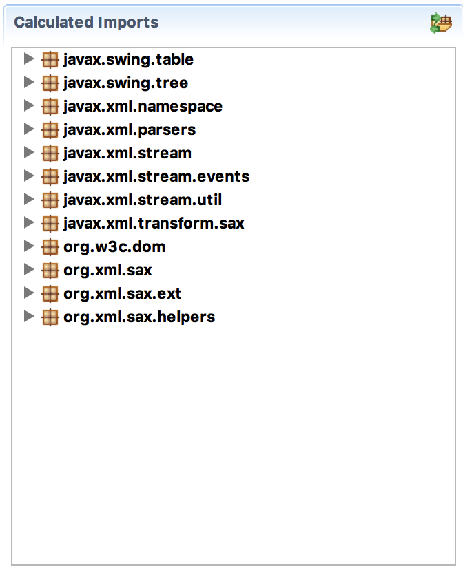

The bnd tool contains a nifty feature that it inherited from old school C. In those days, the link phase searched for missing symbols in libraries and automatically included those functions from the library in your code. This was called [static linking](https://kb.iu.edu/d/akqn). Neil Bartlett wrote a [blog] about the subject.

The [-conditionalpackage] instruction performs a similar function for packages. It analyzes the bundle and it will then look on the `-buildpath` for the missing packages. It then adds those packages and analyzes again recursively. There is a caveat that sometimes packages are not sufficient, sometimes there are resources that must be included as well. We'll discuss those issues later.

This is of course very useful, in our wrapper bundle we only want to import from the JVM. All other dependencies should be included. Since we can ignore java.\* packages (they are **always** coming from the JVM), we need to filter out any packages that might come from the VM. All other packages can be copied from the `-buildpath`. We can exclude packages with the `!` operator. So we first exclude the packages from the JVM and then we use the wildcard ('*') to include the remaining packages from the `-buildpath`. This looks as follows.

	-conditionalpackage: \
	  !javax.*, \
	  !org.xml.*, \ 
	  !org.w3c.*, \
	  !org.ietf.jgss, \
	  !org.omg.*, \
	  *

Since our `-buildpath` looked like:

	-buildpath: \
		org.jvnet.hudson.dom4j__dom4j;version=1.6.1.hudson-3,\
		net.java.dev.msv.xsdlib;version=2013.6.1

We should now have included the `com.sun` packages. We can verify this by  by opening the `osgi.enroute.examples.wrapping.dom4j.adapter.jar` file from the `generated` directory in the JAR Editor. At the end of the `Print` tab there is a list of contents and this now contains the `com.sun` packages.

	...
	com
	com/sun
	com/sun/msv
	com/sun/msv/datatype
	  DatabindableDatatype.class
	  ErrorDatatypeLibrary.class
	  SerializationContext.class
	com/sun/msv/datatype/xsd
	  AnyURIType.class
	...

We will have to repeat this process for each package that is not included in the the JVM. For Java 1.8, the following `-buildpath` had no more extraneous imports:

	-buildpath: \
		org.jvnet.hudson.dom4j__dom4j;version=1.6.1.hudson-3,\
		xmlpull__xmlpull;version=1.1.3.4d_b4_min,\
		pull-parser__pull-parser;version=2.1.10,\
		jaxen;version=1.1.6,\
		net.java.dev.msv.xsdlib;version=2013.6.1,\
		relaxngDatatype__relaxngDatatype;version=20020414.0

We can look at the `Contents` tab of the `bnd.bnd` file to see if we covered all our inputs that do not originate from the JVM.

{: width="50%" }

Looks good but are we ready now? Hmm. We have not looked at all what the consequences are of including the packages. In the next section we go through the potential options and hazards.
 
[DOM4J]: http://jpm4j.org/#!/p/org.jdom/jdom
[JPM4J]: http://jpm4j.org/
[-conditionalpackage]: http://bnd.bndtools.org/instructions/conditionalpackage.html
[blog]: http://njbartlett.name/2014/05/26/static-linking.html
[133 Service Loader Mediator Specification]: http://blog.osgi.org/2013/02/javautilserviceloader-in-osgi.html
[semanticaly versioned]: http://bnd.bndtools.org/chapters/170-versioning.html 
[135.3 osgi.contract Namespace]: http://blog.osgi.org/2013/08/osgi-contracts-wonkish.html
[BSD style license]: http://dom4j.sourceforge.net/dom4j-1.6.1/license.html
[supernodes of small worlds]: https://en.wikipedia.org/wiki/Small-world_network
[OSGiSemVer]: https://www.osgi.org/wp-content/uploads/SemanticVersioning.pdf
[osgi.enroute.examples.wrapping.dom4j.adapter]: https://github.com/osgi/osgi.enroute.examples/osgi.enroute.examples.wrapping.dom4j.adapter