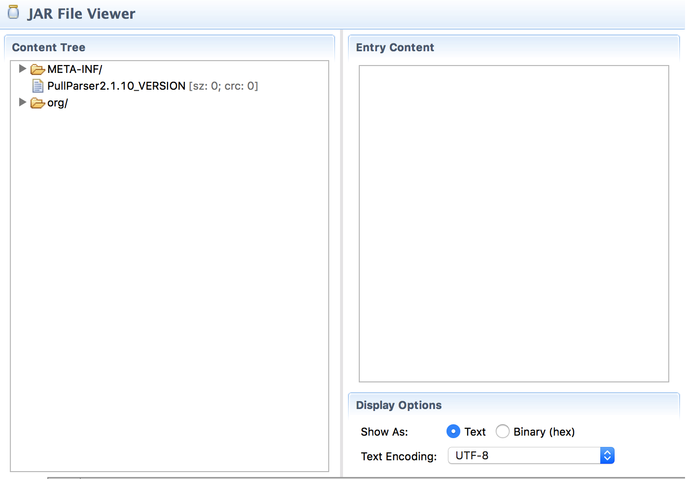

JARs are extremely flexible, they can contain any type of resource. So far, we've only focused on packages. However, we can also copy resources from the JARs on our `-buildpath` (or file system) into our target JAR.

The `pull-parser__pull-parser-2.1.10.jar` contains an (empty) file in the root of the JAR named `PullParser2.1.10_VERSION`. You can see that resource from the `Bnd Bundle Path` container. Maybe the parser assumes this resource in its root so we better make sure it is included. To include resources from the `-buildpath` or file system we use the `-includeresource` instruction.

	-includeresource: \
		@pull-parser__pull-parser-2.1.10.jar!/PullParser*_VERSION

The `-includeresource` instruction can take any resources from the file system but it has a nifty feature to also use resources from the `-buildpath`. If you prefix a resource with `@` then it will assume a JAR file. It will first look on the file system but if it is not there, it will look for that file name (not path) in the `-buildpath`. You could include the whole JAR but with the `!/` pattern you can single out a resource. (This is standard for JAR URLs.) The resource will then be copied to the same path in the target bundle. 

And as usual in bnd, you can use a wildcard character '*' to not hardcode the version number.

You can verify that the resource made it in the JAR Editor.

{: width="70%" }

[DOM4J]: http://jpm4j.org/#!/p/org.jdom/jdom
[JPM4J]: http://jpm4j.org/
[-conditionalpackage]: http://bnd.bndtools.org/instructions/conditionalpackage.html
[blog]: http://njbartlett.name/2014/05/26/static-linking.html
[133 Service Loader Mediator Specification]: http://blog.osgi.org/2013/02/javautilserviceloader-in-osgi.html
[semanticaly versioned]: http://bnd.bndtools.org/chapters/170-versioning.html 
[135.3 osgi.contract Namespace]: http://blog.osgi.org/2013/08/osgi-contracts-wonkish.html
[BSD style license]: http://dom4j.sourceforge.net/dom4j-1.6.1/license.html
[supernodes of small worlds]: https://en.wikipedia.org/wiki/Small-world_network
[OSGiSemVer]: https://www.osgi.org/wp-content/uploads/SemanticVersioning.pdf
[osgi.enroute.examples.wrapping.dom4j.adapter]: https://github.com/osgi/osgi.enroute.examples/osgi.enroute.examples.wrapping.dom4j.adapter